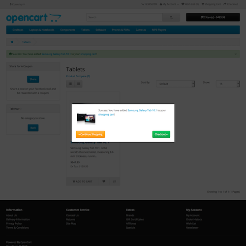

# Add to Cart Notification

* Current Version: 2.0.0
* Last Updated: 23 June 2017
* License: [Commercial License][1]
* Compatibility: OpenCart 1.5.1.x, 1.5.2.x, 1.5.3.x, 1.5.4.x, 1.5.5.x, 1.5.6.x, 2.x, 3.x

[1]: https://www.marketinsg.com/usage-license

## Description

Add to Cart Notification displays a popup notification when your customers add a product to their shopping cart. It also allows your customers to easily proceed to the checkout from the popup notification.

## Features

* Nice and responsive ‘add to cart’ notification
* Proceed to checkout button
* Continue with shopping button

## Installation

### OpenCart Cloud

1. Purchase the extension from your administration panel.
2. Proceed to `Extensions >> Extensions` and select `Modules`. Then, install `Add to Cart Notification`. Configure extension accordingly.
3. Proceed to `Extensions >> Modifications` and click the blue refresh button.
4. Popup notification will now show up when a product is added.

### OpenCart 2 & 3

1. Go to `Admin >> Extensions >> Installer` to upload the extension zip file.
2. Proceed to `Extensions >> Extensions` and select `Modules`. Then, install `Add to Cart Notification`. Configure extension accordingly.
3. Proceed to `Extensions >> Modifications` and click the blue refresh button.
4. Popup notification will now show up when a product is added.

### OpenCart 1.5

1. Unzip the files. Ensure that vQmod has been installed.
2. Upload the files WITHIN the upload folder to your OpenCart installation folder with a FTP client. The folders should merge.
3. In your admin panel, proceed to `Extensions >> Modules`. Then, install `Add to Cart Notification`. Configure extension accordingly.
4. Popup notification will now show up when a product is added.

## Configurations

### OpenCart 1.5, 2, 3 & Cloud

There are no configurations required for Add to Cart Notification. Head over to your store front and add an item to cart, you should now see the Add to Cart Notification popup as per below.

## Change Log

### Version 2.0.0 (23/06/2017)
* Fixed compatibility with OpenCart 3.0.0.0
* Added installer package for OpenCart 2 release
* Added language file for easier translation
* Ceased support for OpenCart 1.5

### Version 1.1.4 (08/07/2016)
* Fixed compatibility with OpenCart 2.3.0.0

### Version 1.1.3 (31/03/2016)
* Added proper classes for buttons on OpenCart 2.2.0.0

### Version 1.1.2 (04/03/2016)
* Improved licensing system
* Checked with compatibility with OpenCart 2.2.0.0

### Version 1.1.1 (24/02/2016)
* Fixed issue with automated installation

### Version 1.1.0 (25/01/2016)
* Added automated extension installation

### Version 1.0.4 (02/04/2015)
* Fixed compatibility with OpenCart 2.0.2.0

### Version 1.0.3 (14/03/2015)
* Improved compatibility with mobile devices
* Improved placing of popup box

### Version 1.0.2 (07/10/2014)
* Fixed compatibility with OpenCart 2.0.0.0

### Version 1.0.1 (27/05/2014)
* Fixed minor bugs

### Version 1.0.0 (28/03/2014)
* Module created