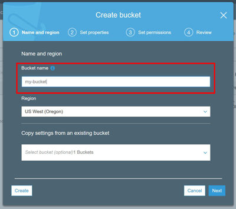
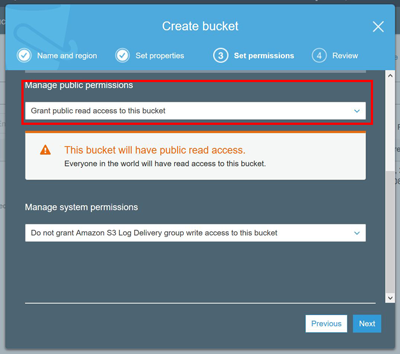
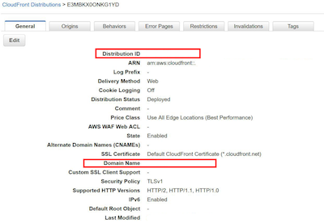
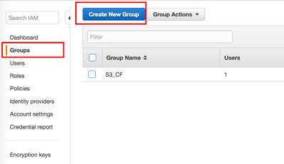
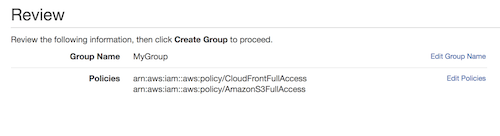
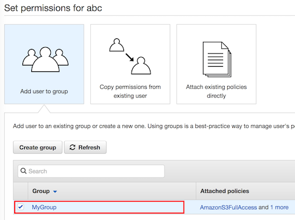

# Amazon CloudFront / S3

* Current Version: 1.1.2
* Last Updated 14 April 2019
* License: [Commercial License][1]
* Compatibility: OpenCart 2.x, 3.x

[1]: https://www.marketinsg.com/usage-license

## Description

Speed up image loading on your website using Amazon CloudFront. This integration allows you to easily upload your OpenCart image cache onto S3 and serve it through CloudFront.

## Features

* Link OpenCart store to S3 and CloudFront
* Easily serve images through CloudFront
* Easily upload the Download files to S3
* One click build or clear image cache
* One click to export download files to S3
* Easily invalidate CloudFront URL by clearing image cache

### Installation

### OpenCart Cloud

1. Purchase the extension from your administration panel.
2. Proceed to `Extensions >> Extensions` and select `Modules`. Then, install `Amazon CloudFront / S3`. Configure extension accordingly.
3. Proceed to `Extensions >> Modifications` and click the blue refresh button.
4. Please view configuration details below.

### Opencart 3

1. Go to `Admin >> Extensions >> Installer` to upload the extension zip file.
2. Proceed to `Extensions >> Extensions` and select `Modules`. Then, install `Amazon CloudFront / S3`. Configure extension accordingly.
3. Proceed to `Extensions >> Modifications` and click the blue refresh button.
4. Please view configuration details below.

### Opencart 2

1. Unzip the files. Ensure that vQmod has been installed.
2. Upload the files WITHIN the upload folder to your OpenCart installation folder with a FTP client. The folders should merge.
3. In your admin panel, proceed to `Extensions >> Modules`. Then, install `Amazon CloudFront / S3`. Configure extension accordingly.
4. Please view configuration details below.

## Configurations

### Opencart 2, 3 & Cloud

Upon installation of Amazon CloudFront / S3, you should will need to enter your Amazon S3 details to begin using the extension.

#### Setting Up S3 Bucket

1. Proceed to your S3 Console at https://s3.console.aws.amazon.com/s3/home.
2. Click the "Create Bucket" button.
3. Enter a bucket name (e.g. mywebsite-com) and click "Next" till step 3, Set Permissions.

	

4. Under "Manage Public Permissions", set "Grant public read access to this bucket" and click "Next" to review your settings.

	

5. Save and create the bucket.
6. Copy the bucket name and put it into your OpenCart settings.
7. Repeat steps above for the second bucket, and do not grant public read access for your download files bucket.

#### Setting Up CloudFront

1. Proceed to your CloudFront Console at https://console.aws.amazon.com/cloudfront/home.
2. Click the "Create Distribution" button.
3. Click the "Get Started" option for the web.
4. Click the field "Origin Domain Name" and select your newly created S3 bucket.
5. Remaining fields have been automatically filled for you. Scroll to the bottom and click "Create Distribution".
6. Copy the CloudFront domain and the distribution ID and put it into your OpenCart settings. Do ensure the domain is entered correctly (https://example.cloudfront.com/) wit the trailing slash.
	
	

#### Setting Up IAM User

1. Proceed to your IAM Console at https://console.aws.amazon.com/iam/home.
2. Select the "Groups" menu and click "Create New Group".

	

3. Give a group name, then proceed to the next step to attach policy.
4. Attach "AmazonS3FullAccess" and "CloudFrontFullAccess".
5. Click "Next" then create group.

	

6. Select the "Users" menu and click "Add User".
7. Give a user name and select the checkbox for "Programmatic access". Click next to Permissions.
8. Select "Add User to Group" and select the checkbox for the user group you've newly created.

	

9. Click "Next" to review user settings and click "Create User".
10. Copy the "Access Key" and the "Secret Key" and put it into your OpenCart settings.

## Change Log

### Version 1.1.2 (14/04/2019)
* Fixed incorrect function being called in OC 3.0
### Version 1.1.1 (15/05/2018)
* Fixed incorrect function being called in OC 2.0 release
### Version 1.1.0 (19/02/2018)
* Added download files integration with S3
### Version 1.0.0 (08/02/2018)
* Extension created
