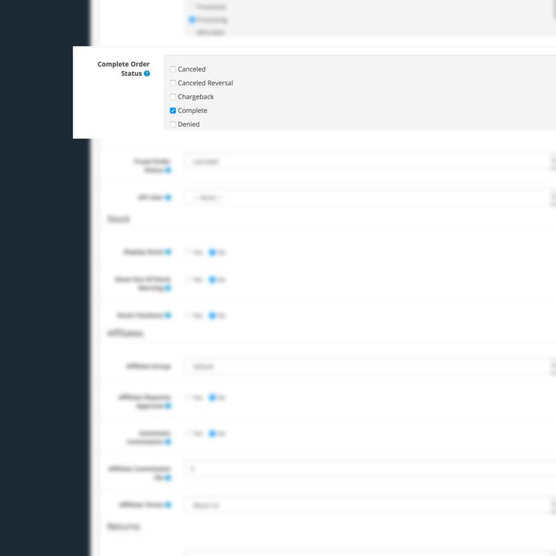
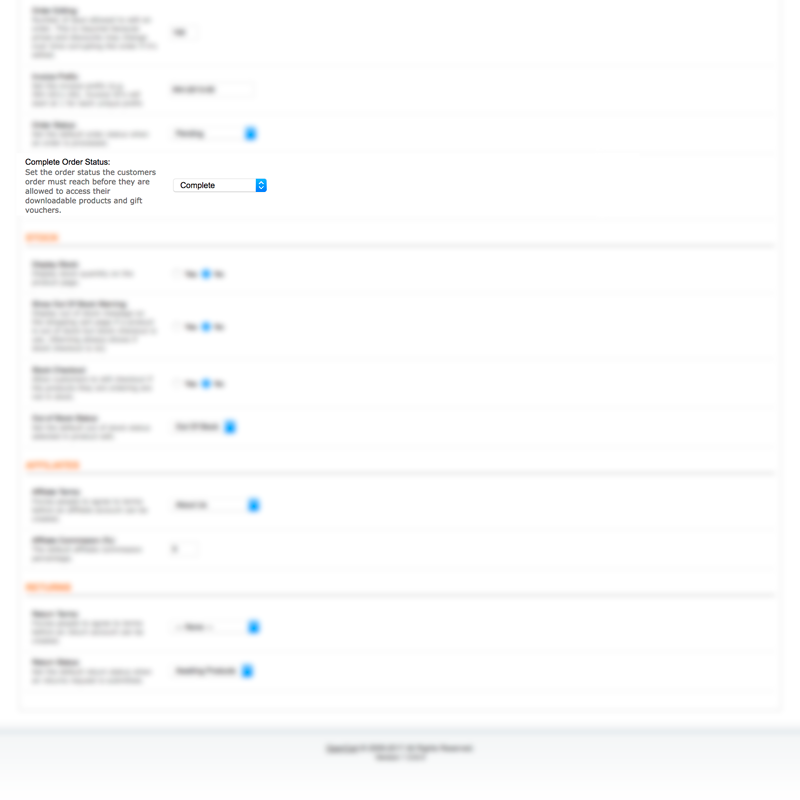

# Auto Reward Points

* Current Version: 2.0.0
* Last Updated: 24 June 2017
* License: [Commercial License][1]
* Compatibility:
OpenCart 1.5.1.x, 1.5.2.x, 1.5.3.x, 1.5.4.x, 1.5.5.x, 1.5.6.x, 2.x, 3.x

[1]: https://www.marketinsg.com/usage-license

## Description

OpenCart does not automatically add reward points for completed orders. Are you tired of manually doing so? This extension will handle it for you! The system will automatically add reward points for completed orders based on the points OpenCart has calculated. As simple as that, let automation ease your daily workload!

## Features

* Automatically add reward points for completed orders
* 100% new files
* Simple installation with installer available

## Installation

### OpenCart Cloud

1. Purchase the extension from your administration panel.
2. Proceed to `Extensions >> Extensions` and select `Modules`. Then, install `Auto Reward Points`. Configure extension accordingly.
3. Proceed to `Extensions >> Modifications` and click the blue refresh button.
4. Please view configuration details below.

### OpenCart 2 & 3

1. Go to `Admin >> Extensions >> Installer` to upload the extension zip file.
2. Proceed to `Extensions >> Extensions` and select `Modules`. Then, install `Auto Reward Points`. Configure extension accordingly.
3. Proceed to `Extensions >> Modifications` and click the blue refresh button.
4. Please view configuration details below.

### OpenCart 1.5

1. Unzip the files. Ensure that vQmod has been installed.
2. Upload the files WITHIN the upload folder to your OpenCart installation folder with a FTP client. The folders should merge.
3. In your admin panel, proceed to `Extensions >> Modules`. Then, install `Auto Reward Points`. Configure extension accordingly.
4. Please view configuration details below.

## Configurations

### OpenCart 2 & 3

1. Complete Order Status Configuration

You can configure the order complete status in `System >> Settings >> Edit Store >> Options Tab`. Upon changing to any of the configured complete order statuses, reward points will be automatically given to the registered customer.

### OpenCart 1.5

1. Complete Order Status Configuration

You can configure the order complete status in `System >> Settings >> Edit Store >> Options Tab`. Upon changing to the configured complete order status, reward points will be automatically given to the registered customer.

## Change Log

###Version 2.0.0 (24/06/2017)
* Fixed compatibility with OpenCart 3.0.0.0

###Version 1.1.3 (08/07/2016)
* Fixed compatibility with OpenCart 2.3.0.0

###Version 1.1.2 (04/03/2016)
* Improved code quality

###Version 1.1.1 (24/02/2016)
* Fixed issue with installation

###Version 1.1.0 (25/01/2016)
* Improved installation method

###Version 1.0.1 (09/03/2015)
* Fixed points being added to guest

###Version 1.0.0 (21/02/2015)
* Extension created