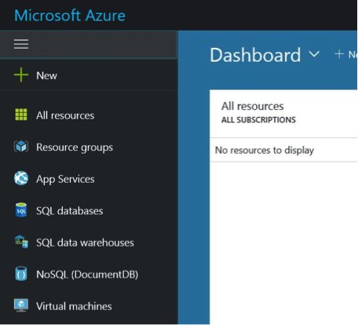
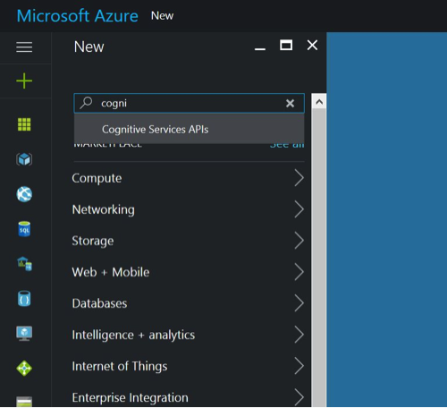
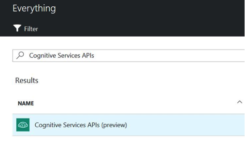
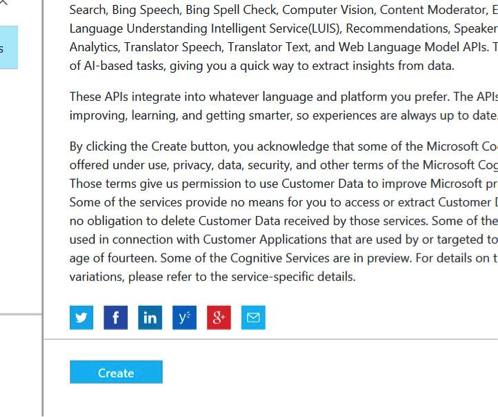
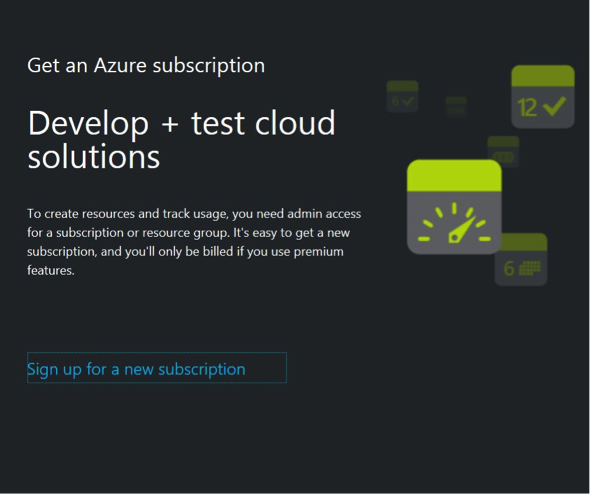
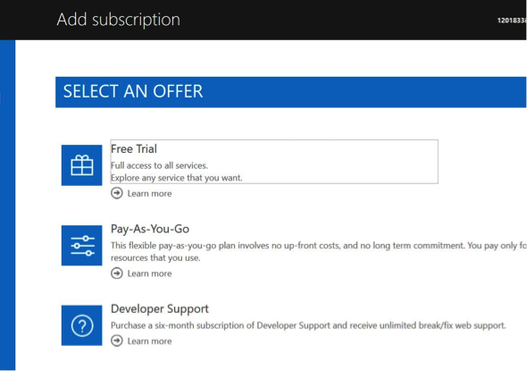
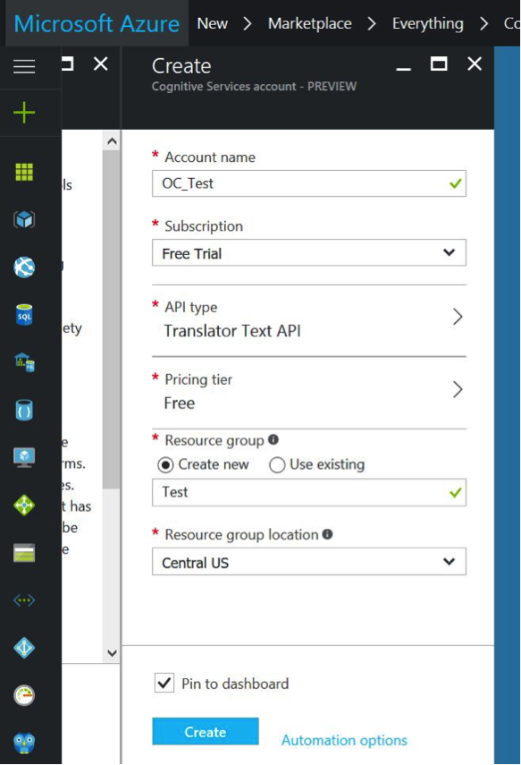
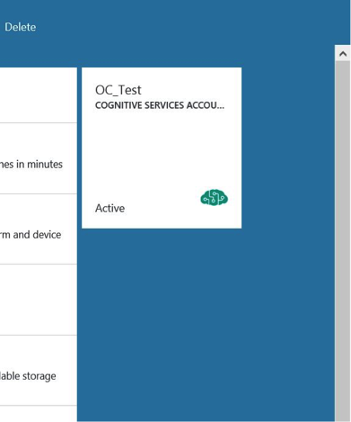
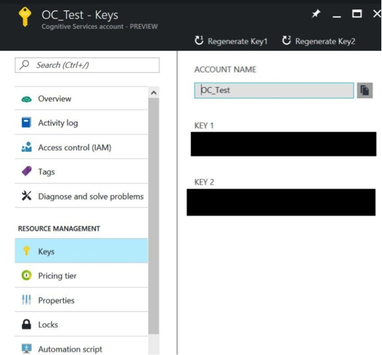

# Auto Translate

* Current Version: 2.0.1
* Last Updated: 09 December 2017
* License: [Commercial License][1]
* Compatibility: OpenCart 1.5.1.x, 1.5.2.x, 1.5.3.x, 1.5.4.x, 1.5.5.x, 1.5.6.x, 2.x, 3.x

[1]: https://www.marketinsg.com/usage-license

## Description

Tired of manually translating your data in your OpenCart store? Looking for automated translation that’s affordable? Auto Translate will do just the job! Using Microsoft’s translation API, accurate translation is done automatically, right from your administration panel.

Note: You will need to sign up with Microsoft to use their translation API. Microsoft has a free tier that supports up to 2 million characters translation per month! Credit card is required to subscribe to Microsoft Azure (your card wouldn’t be charged unless you use more than the free limit). 

## Features

* Automatically mass translate your products, categories, information pages etc.
* Adds quick translate button beside fields that can be translated
* Uses Microsoft Azure translation API
* Translate your website to over 40 languages
* Machine translation, preserves your source styles and formatting in product description

## Installation

### OpenCart Cloud

1. Purchase the extension from your administration panel.
2. Proceed to `Extensions >> Extensions` and select `Modules`. Then, install `Auto Translate`. Configure extension accordingly.
3. Proceed to `Extensions >> Modifications` and click the blue refresh button.
4. Ensure that your server has PHP SOAP installed.
5. You can now mass translate or translate individual fields on your store.
6. Please read on below for more information on getting your Microsoft App Key.

### OpenCart 2 & 3

1. Go to `Admin >> Extensions >> Installer` to upload the extension zip file.
2. Proceed to `Extensions >> Extensions` and select `Modules`. Then, install `Auto Translate`. Configure extension accordingly.
3. Proceed to `Extensions >> Modifications` and click the blue refresh button.
4. Ensure that your server has PHP SOAP installed.
5. You can now mass translate or translate individual fields on your store.
6. Please read on below for more information on getting your Microsoft App Key.

### OpenCart 1.5

1. Unzip the files. Ensure that vQmod has been installed.
2. Upload the files WITHIN the upload folder to your OpenCart installation folder with a FTP client. The folders should merge.
3. In your admin panel, proceed to `Extensions >> Modules`. Then, install `Auto Translate`. Configure extension accordingly.
4. Ensure that your server has PHP SOAP installed.
5. You can now mass translate or translate individual fields on your store.
6. Please read on below for more information on getting your Microsoft App Key.

## Configurations

### OpenCart 1.5, 2, 3 & Cloud

1. Sign up with Microsoft Azure

	If you do not have a Microsoft Azure account, sign up at [http://azure.com/][1]. If you do, login at [http://portal.azure.com/][2].
[1]: http://azure.com/
[2]: http://portal.azure.com/

2. Creating a New Application

	a. After logging in, you should see the dashboard. Click 'New' in the menu.

	

	b. Search for ‘Cognitive Services APIs’ and select it.

	
	

	c. Click ‘Create’ to proceed with creating the application.

	

	d. If you do not have a subscription, you will need to sign up for an Azure subscription. Select ‘free trial’ if it’s available to you. Proceed to fill in your personal particulars and card details for Microsoft to activate your subscription.

	
	

	e. Once done with the subscription, continue with creating the application. Ensure you setup correctly, and select ‘Translator Text API’.

	

3. Getting Your Key

	Once the application has been created, click to enter the application console. Then, select ‘Keys’ menu to retrieve your key. Copy Key 1 to the Auto Translate extension in your OpenCart store to begin.

	
	

## Change Log

### Version 2.0.1 (09/12/2017)
* Fixed minor bugs with OpenCart 3 release
### Version 2.0.0 (24/06/2017)
* Fixed compatibility with OpenCart 3.0.0.0
### Version 1.6.0 (12/01/2017)
* Upgraded API to use Microsoft Azure new API
### Version 1.5.2 (10/10/2016)
* Fixed compatibility with new summernote editor
### Version 1.5.1 (08/07/2016)
* Fixed compatibility with OpenCart 2.3.0.0
### Version 1.5.0 (04/03/2016)
* Fixed compatibility with OpenCart 2.0.0.0
* Added translation for meta titles for products, categories and information pages
* Added translation for meta description and meta keywords for information pages
### Version 1.4.3 (22/02/2016)
* Fixed text editor descriptions not decoding before being sent
### Version 1.4.2 (21/02/2016)
* Improvements made to remove repetitive codes
* Better handling of long product descriptions
### Version 1.4.1 (11/12/2015)
* Fixed critical bug fix caused by version 1.4.0
### Version 1.4.0 (09/12/2015)
* Added support for continuing mass translate from a certain point
* Added new design for OC 1.5
### Version 1.3.0 (25/10/2015)
* Changed system to use SOAP instead to support up to 10,000 characters
* Added support for product attributes
### Version 1.2.1 (19/05/2015)
* Minor bug fixes
### Version 1.2.0 (15/05/2015)
* Minor bug fixes
* Admin aesthetic improvements
### Version 1.1.1 (23/04/2015)
* OC 2.0.2.0 mail support compatibility fix
### Version 1.1.0 (10/04/2015)
* Added mass translate for options and attributes
* Bug fixes
### Version 1.0.0 (04/03/2015)
* Extension created