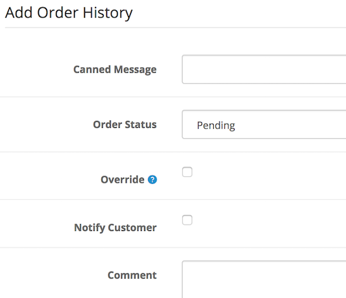

# Canned Messages

* Current Version: 2.0.1
* Last Updated: 3 September 2017
* License: [Commercial License][1]
* Compatibility: OpenCart 1.5.1.x, 1.5.2.x, 1.5.3.x, 1.5.4.x, 1.5.5.x, 1.5.6.x, 2.x, 3.x

[1]: https://www.marketinsg.com/usage-license

## Description

Manually typing the same order history comments for each of your orders can be tiring. Wouldn’t it be good to have a list of pre-set templates for the order comments? Canned Messages is exactly what you need! You will be able to setup a list of pre-set messages that you can use when updating the order history. 

## Features

* Pre-set a list of messages for use on order history comments
* Sort order to sort the messages, place often used messages at the top
* Unlimited canned messages
* Available template codes to use for the canned messages
	* {firstname}
	* {lastname}
	* {email}
	* {telephone}
	* {order_id}
	* {date_added}
	* {payment_method}
	* {shipping_method}

## Installation

### OpenCart Cloud

1. Purchase the extension from your administration panel.
2. Proceed to `Extensions >> Extensions` and select `Modules`. Then, install `Canned Messages`. Configure extension accordingly.
3. Proceed to `Extensions >> Modifications` and click the blue refresh button.
4. Please view configuration details below.

### OpenCart 3

1. Go to `Admin >> Extensions >> Installer` to upload the extension zip file.
2. Proceed to `Extensions >> Extensions` and select `Modules`. Then, install `Canned Messages`. Configure extension accordingly.
3. Proceed to `Extensions >> Modifications` and click the blue refresh button.
4. Please view configuration details below.

### OpenCart 1.5 & 2

1. Unzip the files. Ensure that vQmod has been installed.
2. Upload the files WITHIN the upload folder to your OpenCart installation folder with a FTP client. The folders should merge.
3. In your admin panel, proceed to `Extensions >> Modules`. Then, install `Canned Messages`. Configure extension accordingly.
4. Please view configuration details below.

## Configurations

### OpenCart 1.5, 2, 3 & Cloud

1. Setup Canned Messages

	Configure Canned Messages in your admin panel to begin. Then, you should be able to see the canned message selection when updating your order history.

	

## Change Log

### Version 2.0.1 (03/09/2017)
* Fixed incorrect token for OpenCart 2 release
### Version 2.0.0 (24/06/2017)
* Fixed compatibility with OpenCart 3.0.0.0
### Version 1.0.4 (29/04/2017)
* Fixed incorrect directory path for OpenCart 1.5
### Version 1.0.3 (08/07/2016)
* Fixed compatibility with OpenCart 2.3.0.0
### Version 1.0.2 (04/03/2016)
* Improved installation manual
* Version number unchanged
### Version 1.0.2 (26/12/2015)
* Enhanced module interface
### Version 1.0.1 (23/04/2015)
* OC 2.0.2.0 mail support compatibility fix
### Version 1.0.0 (06/03/2015)
* Extension created