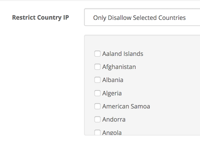

# Country IP Rules

* Current Version: 2.0.1
* Last Updated: 09 December 2017
* License: [Commercial License][1]
* Compatibility: 2.x, 3.x

[1]: https://www.marketinsg.com/usage-license

## Description

Ever need to detect your customer’s IP address and setup rules accordingly? Country IP Rules does just that! Redirect your customers to a different page based on their IP address, or control their default currency and language with this extension.

## Features

* Display currency based on IP address
* Display language based on IP address
* Display categories based on IP address
* Display manufacturer based on IP address
* Display products based on IP address
* Restricted products are dependent on the category or manufacturer assigned
* Redirect to URL based on IP address

## Installation

### OpenCart Cloud

1. Purchase the extension from your administration panel.
2. Proceed to `Extensions >> Extensions` and select `Modules`. Then, install `Country IP Rules`. Configure extension accordingly.
3. Proceed to `Extensions >> Modifications` and click the blue refresh button.
4. You can now control the IP address rules accordingly from the module or the respective category or manufacturer pages.

### OpenCart 2 & 3

1. Go to `Admin >> Extensions >> Installer` to upload the extension zip file.
2. Proceed to `Extensions >> Extensions` and select `Modules`. Then, install `Country IP Rules`. Configure extension accordingly.
3. Proceed to `Extensions >> Modifications` and click the blue refresh button.
4. You can now control the IP address rules accordingly from the module or the respective category or manufacturer pages.

## Configurations

### OpenCart 2, 3 & Cloud

Most of the configurations for the extension can be found in `Admin >> Extensions >> Modules >> Country IP Rules`.

For additional configurations such as restricting products through the manufacturer or linked categories (`Admin >> Catalog >> Category >> Edit Category >> Data Tab`), you can do so at the respective manufacturer or category page. You should see a field similar to the below to configure the restrictions.

## Change Log

### Version 2.0.1 (26/06/2017)
* Improved IP detection
### Version 2.0.0 (26/06/2017)
* Fixed compatibility with OpenCart 3.0.0.0
* Fixed minor bugs and improvements
### Version 1.0.1 (09/07/2016)
* Fixed compatibility with OpenCart 2.3.0.0