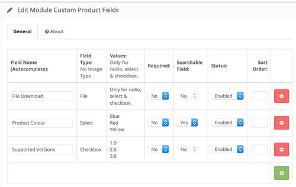
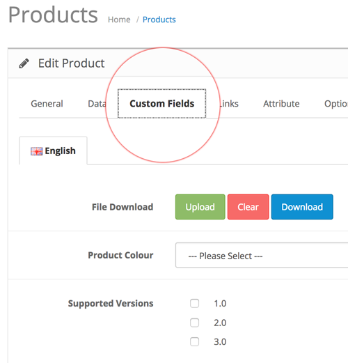

# Custom Product Fields

* Current Version: 3.0.1
* Last Updated: 12 July 2018
* License: [Commercial License][1]
* Compatibility: OpenCart 1.5.1.x, 1.5.2.x, 1.5.3.x, 1.5.4.x, 1.5.5.x, 1.5.6.x, 2.x, 3.x

[1]: https://www.marketinsg.com/usage-license

## Description

Custom Product Fields allows you to add an unlimited number of custom fields to your product form. If you are looking for an easy way to allow your customers to download an installation manual or display some extra details about your product, this extension is just what you need!

Custom Product Fields also supports searching of the fields (except for checkbox and file type fields) you have added. You can toggle the added fields to be searchable in your OpenCart’s default search.

## Features

* Unlimited custom products fields
* Multi-language supported
* Set fields required / not required in product form
* Allow text fields
* Allow file upload fields
* Allow date fields
* Allow date time fields
* Allow textarea fields
* Allow select fields
* Allow checkbox fields
* Allow radio fields
* Searchable fields (except checkbox and file type options)

## Installation

### OpenCart Cloud

1. Purchase the extension from your administration panel.
2. Proceed to `Extensions >> Extensions` and select `Modules`. Then, install `Custom Product Fields`. Configure extension accordingly.
3. Proceed to `Extensions >> Modifications` and click the blue refresh button.
4. The additional fields should now show up in a tab in your product form.

### OpenCart 3

1. Go to `Admin >> Extensions >> Installer` to upload the extension zip file.
2. Proceed to `Extensions >> Extensions` and select `Modules`. Then, install `Custom Product Fields`. Configure extension accordingly.
3. Proceed to `Extensions >> Modifications` and click the blue refresh button.
4. The additional fields should now show up in a tab in your product form.

### OpenCart 1.5 & 2

1. Unzip the files. Ensure that vQmod has been installed.
2. Upload the files WITHIN the upload folder to your OpenCart installation folder with a FTP client. The folders should merge.
3. In your admin panel, proceed to `Extensions >> Modules`. Then, install `Custom Product Fields`. Configure extension accordingly.
4. The additional fields should now show up in a tab in your product form.

## Configurations

### OpenCart 1.5, 2, 3 & Cloud

1. Setting Up Fields

	Additional fields can be configured from the Custom Product Fields page.

	

2. Filling Up Custom Fields

	You can access the newly created custom fields in your admin panel `Catalog >> Products >> Edit Products`.

	

## Change Log

### Version 3.0.1 (12/07/2018)
* Fixed null columns handling for OpenCart 3
### Version 3.0.0 (27/06/2017)
* Fixed compatibility with OpenCart 3.0.0.0
* Minor updates and improvements
* Ceased support for OpenCart 1.5
### Version 2.1.2 (09/07/2016)
* Fixed compatibility with OpenCart 2.3.0.0
### Version 2.1.1 (07/03/2016)
* Fixed compatibility with OpenCart 2.2.0.0
### Version 2.1.0 (13/05/2015)
* Added support for searchable fields for OpenCart 1.5
* Added support to decode HTML entities on front end
### Version 2.0.2 (23/04/2015)
* Fixed mail compatibly with OpenCart 2.0.2.0
### Version 2.0.1 (12/01/2015)
* Fixed for OpenCart copy function
### Version 2.0.1 (22/12/2014)
* Fixed Facebook support link
### Version 2.0.0 (09/10/2014)
* Fixed compatibly with OC 2
* Added searchable fields for OpenCart 2
* New data storage structure
### Version 1.4.0 (23/04/2014)
* Allow download of uploaded files from admin
### Version 1.3.1 (17/11/2013)
* Bug fixes
### Version 1.3.0 (28/10/2013)
* Prevent empty field settings
* Clear button for uploaded files
### Version 1.2.0 (25/07/2013)
* Bug fix for empty checkbox
### Version 1.1.0 (18/05/2013)
* Allows empty value for select fields