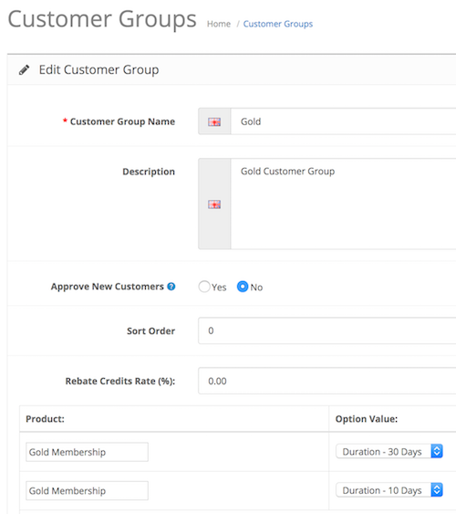
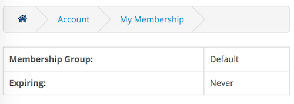
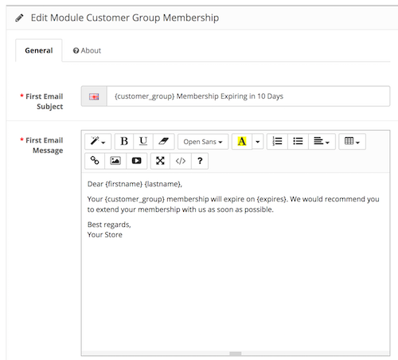
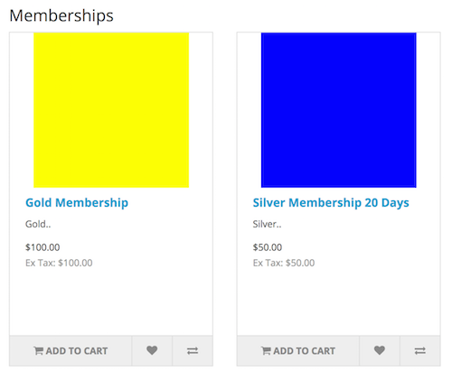

# Customer Group Membership

* Current Version: 2.0.1
* Last Updated: 22 July 2017
* License: [Commercial License][1]
* Compatibility: OpenCart 1.5.1.x, 1.5.2.x, 1.5.3.x, 1.5.4.x, 1.5.5.x, 1.5.6.x, 2.x, 3.x

[1]: https://www.marketinsg.com/usage-license

## Description

Customer Group Membership allows you to sell your customer groups on OpenCart as a membership. You can make use of the built in customer groups to give special prices for various customer groups, or give credit rebates to your customers.

## Features

* Sell your customer groups as membership
* Give X% credit rebate based on the customer group
* Send notification email when membership is expiring
* List the memberships available on your website with the membership module
* Customer can check when their membership is expiring from their account
* Admin can modify / assign membership to customers

X% credit rebate is given to the customer after their order reaches the complete order status, so the customer can use the rebate credits on their next purchase. This encourages your customer to shop with you again.

## Installation

### OpenCart Cloud

1. Purchase the extension from your administration panel.
2. Proceed to `Extensions >> Extensions` and select `Modules`. Then, install `Customer Group Membership`. Configure extension accordingly.
3. Proceed to `Extensions >> Modifications` and click the blue refresh button.

### OpenCart 3

1. Go to `Admin >> Extensions >> Installer` to upload the extension zip file.
2. Proceed to `Extensions >> Extensions` and select `Modules`. Then, install `Customer Group Membership`. Configure extension accordingly.
3. Proceed to `Extensions >> Modifications` and click the blue refresh button.

### OpenCart 1.5 & 2

1. Unzip the files. Ensure that vQmod has been installed.
2. Upload the files WITHIN the upload folder to your OpenCart installation folder with a FTP client. The folders should merge.
3. In your admin panel, proceed to `Extensions >> Modules`. Then, install `Customer Group Membership`. Configure extension accordingly.

## Configurations

### OpenCart 1.5, 2, 3 & Cloud

1. Configuring a Group for Sale

	Start selling a customer group. Head over to the customer group page in your admin and add / edit a group. At the bottom of the page, you will be able to link a product to the specific group.

	

	The customer that purchases the linked product will automatically be assigned to the customer group you've configured. The duration field allows you to set the duration the customer remains in the customer group, before being assigned back to the system's default customer group.

2. Configuring Rebate Rate

	You can setup a rebate rate for a specific customer group, so the customer receives rebates for each order made on your store. Rebates are only given after the order has been marked complete (configurable in your system settings).

3. Viewing Membership Status

	The customer can view the membership status from his account on the store front. The admin will be able to view the customer's membership from the customer edit page.

	

4. Configuring Reminder Email

	You can setup reminder emails to remind your customer to renew their membership, or sign up to another membership again. Membership reminder emails can be configured right from our Customer Group Membership module.

	

5. Memberships Display Module

	An additonal module can be added to your layouts to display the available memberships you have for sale on your website. In OpenCart 2, 3 and Cloud, you will do it through the layouts management page. In OpenCart 1.5, you will do it through our module page itself.

	

## Change Log

### Version 2.0.1 (22/07/2017)
* Fixed mail reminder issue for OpenCart 2.3 release
### Version 2.0.0 (26/06/2017)
* Fixed compatibility with OpenCart 3.0.0.0
* Minor updates and improvements
* Ceased support for OpenCart 1.5
### Version 1.4.5 (25/04/2017)
* Fixed old records not being removed when account upgraded
### Version 1.4.4 (09/07/2016)
* Fixed compatibility with OpenCart 2.3.0.0
### Version 1.4.3 (24/05/2016)
* Fixed email notification still sending despite already renewed
* Fixed minor bugs
### Version 1.4.2 (07/03/2016)
* Fixed compatibility with OpenCart 2.2.0.0
* Removed backwards compatibility upgrade function
* Fixed bugs with membership module
### Version 1.4.1 (29/12/2015)
* Resolved compatibility issue with OC 2.1.0.0 auto complete
### Version 1.4.0 (12/12/2015)
* Fixed duration overlapping when purchased the same membership group
### Version 1.3.1 (10/10/2015)
* Made compatible with OC 2.1.0.0
### Version 1.3.0 (15/05/2015)
* Minor admin aesthetic improvements
### Version 1.2.1 (23/03/2015)
* OC 2.0.2.0 mail support compatibility fix
### Version 1.2.0 (16/03/2015)
* Minor bug fixes
* Allow admin to edit customer’s group and expiry
### Version 1.1.1 (22/12/2014)
* Updated Facebook support link
### Version 1.1.0 (23/10/2014)
* OC 2 compatibility
### Version 1.0.0 (27/02/2014)
* Extension created.