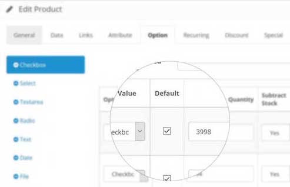

# Default Option Value

* Current Version: 2.0.0
* Last Updated: 27 June 2017
* License: [Commercial License][1]
* Compatibility: OpenCart 1.5.1.x, 1.5.2.x, 1.5.3.x, 1.5.4.x, 1.5.5.x, 1.5.6.x, 2.x, 3.x

[1]: https://www.marketinsg.com/usage-license

## Description

Do you need an option value selected by default when your customers view your products? This extension will do exactly just that, which will allow you to set the option values to be selected by default.

## Features

* Set option values selected by default
* Supports radio, image, select and checkbox type options
* Supports multiple default value for checkbox type options

## Installation

### OpenCart Cloud

1. Purchase the extension from your administration panel.
2. Proceed to `Extensions >> Extensions` and select `Modules`. Then, install `Default Option Value`. Configure extension accordingly.
3. Proceed to `Extensions >> Modifications` and click the blue refresh button.
4. Please view configuration details below.

### OpenCart 3

1. Go to `Admin >> Extensions >> Installer` to upload the extension zip file.
2. Proceed to `Extensions >> Extensions` and select `Modules`. Then, install `Default Option Value`. Configure extension accordingly.
3. Proceed to `Extensions >> Modifications` and click the blue refresh button.
4. Please view configuration details below.

### OpenCart 1.5 & 2

1. Unzip the files. Ensure that vQmod has been installed.
2. Upload the files WITHIN the upload folder to your OpenCart installation folder with a FTP client. The folders should merge.
3. In your admin panel, proceed to `Extensions >> Modules`. Then, install `Default Option Value`. Configure extension accordingly.
4. Please view configuration details below.

## Configurations

### OpenCart 1.5, 2, 3 & Cloud

1. Setting Default Option Value

You can configure the default option value for each product in `Catalog >> Products >> Edit Product` options tab.

## Change Log

### Version 2.0.0 (27/06/2017)
* Fixed compatibility with OpenCart 3.0.0.0
* Minor improvements and updates
* Ceased support for OpenCart 1.5
### Version 1.1.0 (17/05/2017)
* Added ability to show default prices on listing (requires uncommenting codes)
### Version 1.0.2 (09/07/2016)
* Fixed compatibility with OpenCart 2.3.0.0
### Version 1.0.1 (04/03/2016)
* Fixed minor bugs causing issues with option values
### Version 1.0.0 (03/02/2016)
* Extension created