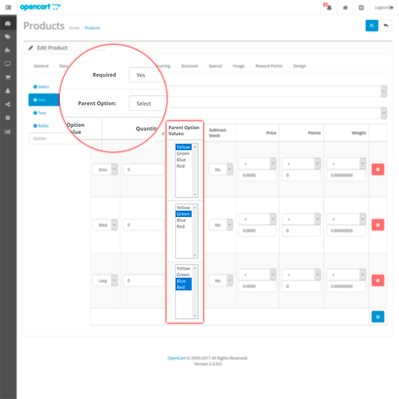
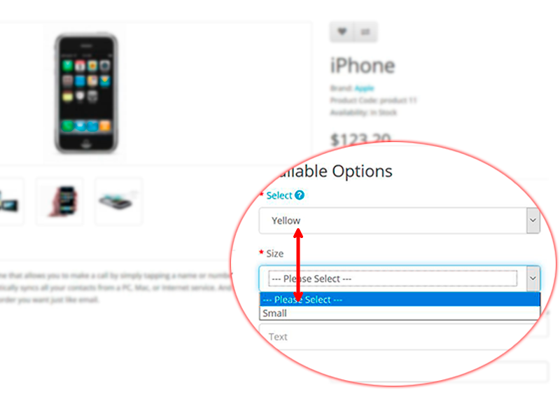

# Dependent Options

* Current Version: 2.0.0
* Last Updated: 28 June 2017
* License: [Commercial License][1]
* Compatibility:
OpenCart 1.5.1.x, 1.5.2.x, 1.5.3.x, 1.5.4.x, 1.5.5.x, 1.5.6.x, 2.x, 3.x

[1]: https://www.marketinsg.com/usage-license

## Description

Dependent Options allows you to display certain options or option values dependent on the parent options in your products. This allows you to be able to set different conditional option values for your product based on the different selected combination.

## Features

* Display certain options or option values based on the selected parent value
* Conditional options on products
* Parent option can only be select type
* Works for all OpenCart built in option types

## Installation

### OpenCart Cloud

1. Purchase the extension from your administration panel.
2. Proceed to `Extensions >> Extensions` and select `Modules`. Then, install `Dependent Options`. Configure extension accordingly.
3. Proceed to `Extensions >> Modifications` and click the blue refresh button.
4. Please view configuration details below.

### OpenCart 3

1. Go to `Admin >> Extensions >> Installer` to upload the extension zip file.
2. Proceed to `Extensions >> Extensions` and select `Modules`. Then, install `Dependent Options`. Configure extension accordingly.
3. Proceed to `Extensions >> Modifications` and click the blue refresh button.
4. Please view configuration details below.

### OpenCart 1.5 & 2

1. Unzip the files. Ensure that vQmod has been installed.
2. Upload the files WITHIN the upload folder to your OpenCart installation folder with a FTP client. The folders should merge.
3. In your admin panel, proceed to `Extensions >> Modules`. Then, install `Dependent Options`. Configure extension accordingly.
4. Please view configuration details below.

## Configurations

### OpenCart 1.5, 2, 3 & Cloud

1. Proceed to `Catalog >> Products >> Edit Product >> Options Tab` to setup the option value dependencies.

2. Parent options must be a `select` type option, and each option can only have one parent.

3. Select the linked parent option values accordingly. Hold the `shift` key on your keyboard to select multiple option values.

	

4. The setup dependencies should now show / hide accordingly on the store front.

	

## Change Log

### Version 2.0.0 (28/06/2017)
* Fixed compatibility with OpenCart 3.0.0.0
* Minor improvements and updates
* Ceased support for OpenCart 1.5

### Version 1.6.3 (10/07/2016)
* Fixed compatibility with OpenCart 2.3.0.0

### Version 1.6.2 (27/03/2016)
* Fixed compatibility with OpenCart 2.2.0.0

### Version 1.6.1 (07/03/2016)
* Improved installation of module
* Fixed text box not clearing values

### Version 1.6.0 (09/12/2015)
* Fixed text box not clearing values when hidden
* Moved dependency controller

### Version 1.5.3 (04/07/2015)
* Fixed minor bugs for OpenCart 2 release

### Version 1.5.2 (21/06/2015)
* Fixed minor bugs for OpenCart 2 release

### Version 1.5.1 (13/05/2015)
* Minor aesthetic improvements in administration panel

### Version 1.5.0 (12/05/2015)
* Improved administration interface design
* Added licensing system

### Version 1.4.2 (23/04/2015)
* Fixed compatibility for OpenCart 2.0.2.0 mail

### Version 1.4.1 (14/04/2015)
* Support for OC 2 date and date time field fixed

### Version 1.4.0 (22/01/2015)
* Added support for import/export extension by MarketInSG

### Version 1.3.1 (22/12/2014)
* Update support Facebook link

### Version 1.3.0 (09/10/2014)
* OC 2 compatibility

### Version 1.2.1 (20/08/2014)
* Bug fixes

### Version 1.2 (29/04/2014)
* Allow hidden options to be not required
* Bug fixes

### Version 1.1.0 (16/11/2013)
* Allow radio and select and checkbox type to hide fully
* Bug fixes

### Version 1.0.1 (26/09/2013)
* Bug fixes