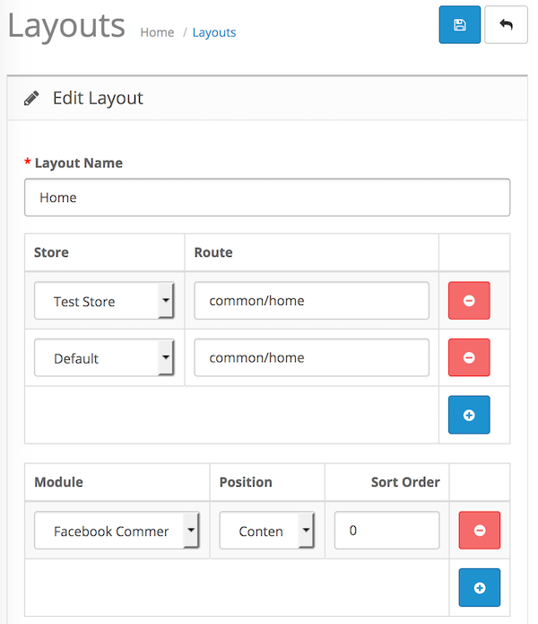

# Facebook Comments

* Current Version: 4.0.0
* Last Updated: 28 June 2017
* License: [Commercial License][1]
* Compatibility: OpenCart 1.5.1.x, 1.5.2.x, 1.5.3.x, 1.5.4.x, 1.5.5.x, 1.5.6.x, 2.x, 3.x

[1]: https://www.marketinsg.com/usage-license

## Description

Ever wanted to allow your customers to comment on your website with their Facebook account? Facebook Comments is just the extension you need. This extension will let your customers post a comment / review on your website with ease via popular social network, Facebook. This extension can be placed anywhere on your site, or even replace the OpenCart’s review tab. The colour scheme, number of comments, and sorting of the comments are all customisable.

## Features

* Display Facebook Comments box
* Post comments/reviews on your website with a Facebook account
* Comments can be moderated from your Facebook account
* Customisable colour scheme (light / dark)
* Customisable number of posts to display
* Sort the comments according to time / reverse time / social relevance
* Able to display Facebook Comments in a tab on your product page

## Installation

### OpenCart Cloud

1. Purchase the extension from your administration panel.
2. Proceed to `Extensions >> Extensions` and select `Modules`. Then, install `Facebook Comments`. Configure extension accordingly.
3. Proceed to `Extensions >> Modifications` and click the blue refresh button.
4. Please view configuration details below.

### OpenCart 3

1. Go to `Admin >> Extensions >> Installer` to upload the extension zip file.
2. Proceed to `Extensions >> Extensions` and select `Modules`. Then, install `Facebook Comments`. Configure extension accordingly.
3. Proceed to `Extensions >> Modifications` and click the blue refresh button.
4. Please view configuration details below.

### OpenCart 1.5 & 2

1. Unzip the files. Ensure that vQmod has been installed.
2. Upload the files WITHIN the upload folder to your OpenCart installation folder with a FTP client. The folders should merge.
3. In your admin panel, proceed to `Extensions >> Modules`. Then, install `Facebook Comments`. Configure extension accordingly.
4. Please view configuration details below.

## Configurations

### Getting Facebook App ID

You will need a Facebook account to setup your Facebook App ID.

1. Proceed to https://developers.facebook.com/apps.
2. Click ‘Add a New App’.
3. Select ‘Website’ when asked for a platform.
4. Give your app a name.
5. Select the category that best matches the app. Click ‘Create App ID’.
6. Skip quick start and proceed to the app settings page.
7. In the settings tab, perform the following:
	1. Fill in your ‘App Domain’. E.g. ('marketinsg.com' will do, do not add the 'www' or 'http://')
	2. Add your ‘Site URL’ under ‘Website’.
	3. Add a contact email.
8. Click ‘Save’.
9. Proceed to the ‘App Review’ tab and change your app to public.
10. Grab your ‘Application ID’ and fill it into our extension’s configurations in your administration panel.

### OpenCart 2, 3 & Cloud

1. Adding Module to Layout

	Once you have installed and enabled the extension, you can add the extension to your layout through the OpenCart's layout management page.

	

### OpenCart 1.5

1. Adding Module to Layout

	Once you have installed the extension, you can add the extension to your layout through the Facebook Comments module settings page itself.

## Change Log

### Version 4.0.0 (28/06/2017)
* Fixed compatibility with OpenCart 3.0.0.0
* Fixed minor bugs and improvements
* Ceased support for OpenCart 1.5
### Version 3.1.2 (10/07/2016)
* Fixed compatibility with OpenCart 2.3.0.0
### Version 3.1.1 (28/04/2016)
* Fixed incorrect directory name for loading template
### Version 3.1.0 (08/03/2016)
* Fixed compatibility with OpenCart 2.2.0.0
* New administration interface for OpenCart 1.5.x
### Version 3.0.2 (23/04/2015)
* Fixed compatibility with OpenCart 2.0.2.0 mail
### Version 3.0.1 (10/10/2014)
* Updated support Facebook link
### Version 3.0.0 (10/10/2014)
* OC 2 compatibility
* Added sort comments
* Added display in tab feature
* Fixed responsive comment box
### Version 2.1.0 (08/01/2013)
* OpenCart v1.5.5 compatibility 
### Version 2.0.0 (17/08/2012)
* Added moderation function