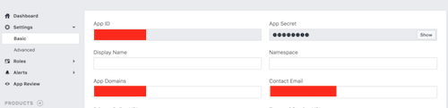
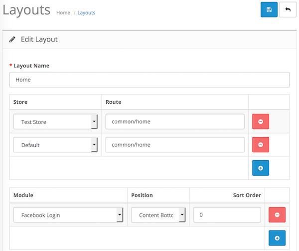

# Facebook Login

* Current Version: 3.0.0
* Last Updated: 25 May 2018
* License: [Commercial License][1]
* Compatibility: OpenCart 1.5.1.x, 1.5.2.x, 1.5.3.x, 1.5.4.x, 1.5.5.x, 1.5.6.x, 2.x, 3.x

[1]: https://www.marketinsg.com/usage-license

## Description

Facebook login is a quick and popular login method. Integrating your store’s login with Facebook will give you an edge over your competitors’ websites. This extension allows your customer to login with Facebook and supports OpenCart multi-store and multi-language feature.

## Features

* Allow Facebook login on your store
* Allow user to create an account on your website in one click
* Does not override account details if user is already a customer
* Customisable button, heading, and display text
* Multi language buttons and texts
* Multi store login supported
* Set Facebook registered customers to a specific customer group
* Set button alignment
* Optionally display a module box around the button
* Optionally display Facebook login button at specific target locations

## Installation

### OpenCart Cloud

1. Purchase the extension from your administration panel.
2. Proceed to `Extensions >> Extensions` and select `Modules`. Then, install `Facebook Login`. Configure extension accordingly.
3. Please view configuration details below.

### OpenCart 2 & 3

1. Go to `Admin >> Extensions >> Installer` to upload the extension zip file.
2. Proceed to `Extensions >> Extensions` and select `Modules`. Then, install `Facebook Login`. Configure extension accordingly.
3. Please view configuration details below.

### OpenCart 1.5

1. Unzip the files.
2. Upload the files WITHIN the upload folder to your OpenCart installation folder with a FTP client. The folders should merge.
3. In your admin panel, proceed to `Extensions >> Modules`. Then, install `Facebook Login`. Configure extension accordingly.
4. Please view configuration details below.

## Upgrading

### All Versions

1. It is recommended to make a backup of your website before proceeding.
2. Follow the installation steps above to upgrade the extension. Files should be replaced.
3. Head over to the extension page and update any new configurations available.

## Configurations

### Getting Facebook App ID and Secret

You will need a Facebook account to setup your Facebook App ID.

1. Proceed to https://developers.facebook.com/apps.
2. Click ‘Add a New App’.
3. Give your app a name.
4. Select 'Facebook Login' when asked for a product, then select 'Web'.
5. Fill in your 'Site URL'. E.g. ('marketinsg.com', do not add 'www' or 'http://').
6. Save your settings and click on Facebook Login settings.
7. Fill up "Valid OAuth Redirect URIs" with your website redirect URL (https://www.website.com/index.php?route=extension/module/fblogin/redirect).
8. Proceed to the app basic settings tab and fill in your privacy URL, email address and app category.
9. Proceed to the ‘App Review’ tab and change your app to public.
10. Grab your ‘Application ID’ and fill it into our extension’s configurations in your administration panel.
11. Grab your 'Application Secret' from the basic settings tab.

### OpenCart 2, 3 & Cloud

1. Adding Module to Layout

	Once you have installed and enabled the extension, you can add the extension to your layout through the OpenCart's layout management page.

	

### OpenCart 1.5

1. Adding Module to Layout

	Once you have installed the extension, you can add the extension to your layout through the Facebook Login module settings page itself.

## Change Log

### Version 3.0.0 (25/05/2018)
* Improved Facebook API
* Added feature to place button at target location
* Added support for custom javascript codes
* Added support for custom Facebook login button image
### Version 2.0.0 (28/06/2017)
* Fixed compatibility with OpenCart 3.0.0.0
* Fixed minor bugs and improvements
* Ceased support for OpenCart 1.5
### Version 1.2.8 (11/07/2016)
* Fixed compatibility with OpenCart 2.3.0.0
### Version 1.2.7 (20/05/2016)
* Fixed login authentication not working
### Version 1.2.6 (11/04/2016)
* Fixed issue where customers can register without email
### Version 1.2.5 (07/03/2016)
* Fixed compatibility with OpenCart 2.2.0.0
* Updated installation manual
### Version 1.2.4 (10/10/2015)
* Fixed compatibility with OpenCart 2.1.0.0
### Version 1.2.3 (16/08/2015)
* Fixed issue with Facebook API 2.4
### Version 1.2.2 (23/04/2015)
* Fixed compatibility with OpenCart 2.0.2.0 mail
### Version 1.2.1 (22/12/2014)
* Fixed Facebook support link
### Version 1.2.0 (10/10/2014)
* Fixed compatibility with OpenCart 2.0.0.0
### Version 1.1.1 (18/04/2014)
* Added redirection back to previous page customer was viewing
### Version 1.1.0 (22/11/2013)
* Added multi store support
### Version 1.0.0 (20/11/2013)
* Module created