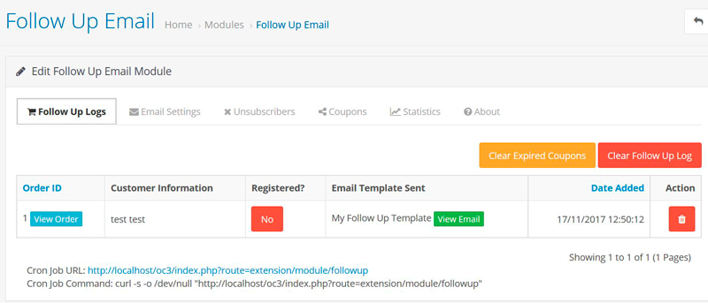
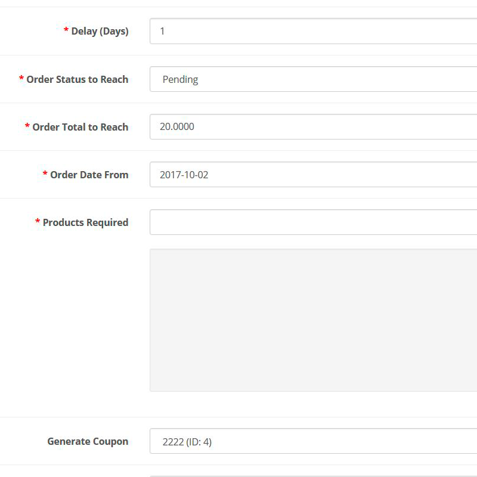

# Follow Up Email

* Current Version: 4.0.1
* Last Updated: 03 December 2017
* License: [Commercial License][1]
* Compatibility: OpenCart 1.5.1.x, 1.5.2.x, 1.5.3.x, 1.5.4.x, 1.5.5.x, 1.5.6.x, 2.x, 3.x

[1]: https://www.marketinsg.com/usage-license

## Description

Following up with your customers after they have made an order is the best customer service you can provide. This extension allows you to automatically send out an email to your customers after their order status reaches the specific status you specify. Ask them to review your products, to like your Facebook page, or anything you can think of.

## Features

* Setup multiple email templates
* Multi-store & multi-language supported
* Customisable subject & email content
* Customisable order status to send email
* Customisable conditions to send email (duration after order, order status to reach, order total to reach, order date from, products required)
* Display the ordered products in the email message
* Set up cron job to automate sending of the emails
* Generate coupon to attach with the email
* Keep a log of all emails sent
* Allow customers to unsubscribe for the follow up emails
* Statistic dashboard to give an overview of the follow ups

## Installation

### OpenCart Cloud

1. Purchase the extension from your administration panel.
2. Proceed to `Extensions >> Extensions` and select `Modules`. Then, install `Follow Up Email`. Configure extension accordingly.
3. Proceed to `Extensions >> Modifications` and click the blue refresh button.
4. Please view configuration details below.

### OpenCart 3

1. Go to `Admin >> Extensions >> Installer` to upload the extension zip file.
2. Proceed to `Extensions >> Extensions` and select `Modules`. Then, install `Follow Up Email`. Configure extension accordingly.
3. Proceed to `Extensions >> Modifications` and click the blue refresh button.
4. Please view configuration details below.

### OpenCart 1.5 & 2

1. Unzip the files. Ensure that vQmod has been installed.
2. Upload the files WITHIN the upload folder to your OpenCart installation folder with a FTP client. The folders should merge.
3. In your admin panel, proceed to `Extensions >> Modules`. Then, install `Follow Up Email`. Configure extension accordingly.
4. Please view configuration details below.

## Configurations

### OpenCart 1.5, 2, 3 & Cloud

1. Module Configurations

	

	All configurations for the extension is located within one single page. You can navigate between the tabs for email configurations to viewing the statistics.

2. Configuring Email Templates

	Get started by configuring the email templates. Each configuration is exaplined below.

	__Name__

	This is for internal identification of the email template.

	__Subject__

	This will be the subject of the email you are sending out.

	__Message__

	Fill up the email content to be sent out.

	__BCC Emails__

	You can setup extra BCC emails, comma separated (e.g. test@web.com,test1@web.com)

	__Delay__

	Configure the number of days the email template should wait before sending out this email. The date order is added is considered day 0. Minimum of 1 day wait is required.

	__Order Status to Reach__

	Configure the order status the order must be at for the email template to send an email out.

	__Order Total to Reach__

	Configure the order total the order must be more than or equal to for the email template to send an email out.

	__Order Date From__

	Configure the date for orders past the set date for the email template to send an email out. This is useful if you just installed this extension with many old orders.

	__Products Required__

	Configure the products required in the order for the email template to send an email out.

	__Generate Coupon__

	Configure the coupon the system should generate along with the email to be sent out. You will need to add the coupon code into the email template using the template code provided.

	__Coupon Duration__

	Configure the validity duration for the coupon.

	

3. Setting Up Cron Job

	Setup a cron job task to automate the export. The cron job command is provided in your admin dashboard. Please copy it and setup your cron job task accordingly in your cPanel.

## Change Log

### Version 4.0.1 (03/12/2017)
* Fixed minor bug for OpenCart 1.5 to OpenCart 2.2.x release
### Version 4.0.0 (17/11/2017)
* Rebuilt of the extension
* Added ability to have multiple email templates
* Added multi-store support
* Added order total restriction
* Added order date restriction
* Added product restriction
* Added coupon generation feature
* Added email logs
* Added coupon and statistics
* Added unsubscribe feature
### Version 3.0.0 (30/06/2017)
* Fixed compatibility with OpenCart 3.0.0.0
* Minor improvements and updates
* Ceased support for OpenCart 1.5
### Version 2.5.1 (11/07/2016)
* Fixed compatibility with OpenCart 2.3.0.0
### Version 2.5.0 (07/03/2016)
* Fixed compatibility with OpenCart 2.2.0.0
* Added ability to list orders not yet sent
### Version 2.4.1 (22/06/2015)
* Fixed minor bugs for OpenCart 2.0.0.0
### Version 2.4.0 (15/05/2015)
* Improved admin interface
### Version 2.3.2 (23/04/2015)
* Fixed mail compatibility with OpenCart 2.0.2.0
### Version 2.3.1 (22/12/2014)
* Fixed Facebook support link
### Version 2.3.0 (13/10/2014)
* OC 2 compatibility
### Version 2.2.0 (04/12/2013)
* Allow users to mark orders sent
* Allows order ID to be placed in subject
### Version 2.1.0 (25/05/2013)
* Allows display of purchased products
* Bug fixes
### Version 2.0.0 (21/04/2013)
* Multi language support
* Order status selection