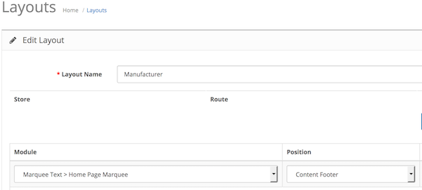

# Footer Position

* Current Version: 3.0.0
* Last Updated: 30 June 2017
* License: [Commercial License][1]
* Compatibility: OpenCart 1.5.1.x, 1.5.2.x, 1.5.3.x, 1.5.4.x, 1.5.5.x, 1.5.6.x, 2.x, 3.x

[1]: https://www.marketinsg.com/usage-license

## Description

Ever wanted to add some text or assign your modules to the footer of your website but realised OpenCart doesn't support the footer content position for your modules? You have found the extension you need!

## Features

* Add a ‘Content Footer’ position to your modules
* Assign modules to the ‘Content Footer’ position

## Installation

### OpenCart Cloud

1. Purchase the extension from your administration panel.
2. Proceed to `Extensions >> Extensions` and select `Modules`. Then, install `Footer Position`. Configure extension accordingly.
3. Proceed to `Extensions >> Modifications` and click the blue refresh button.
4. Please view configuration details below.

### OpenCart 3

1. Go to `Admin >> Extensions >> Installer` to upload the extension zip file.
2. Proceed to `Extensions >> Extensions` and select `Modules`. Then, install `Footer Position`. Configure extension accordingly.
3. Proceed to `Extensions >> Modifications` and click the blue refresh button.
4. Please view configuration details below.

### OpenCart 1.5 & 2

1. Unzip the files. Ensure that vQmod has been installed.
2. Upload the files WITHIN the upload folder to your OpenCart installation folder with a FTP client. The folders should merge.
3. In your admin panel, proceed to `Extensions >> Modules`. Then, install `Footer Position`. Configure extension accordingly.
4. Please view configuration details below.

## Configurations

### OpenCart 2, 3 & Cloud

1. Adding Module to Layout

	Once you have installed and enabled the extension, you can find a new layout position in your layout management page.

	

### OpenCart 1.5

1. Adding Module to Layout

	Once you have installed the extension, you should be able to find the new layout position in all your modules settings page.

## Change Log

### Version 3.0.0 (30/06/2017)
* Fixed compatibility with OpenCart 3.0.0.0
* Minor improvements and updates
* Ceased support for OpenCart 1.5
### Version 2.1.1 (11/07/2016)
* Fixed compatibility with OpenCart 2.3.0.0
### Version 2.1.0 (09/03/2016)
* Improved OpenCart 1.5 release to support position for all modules
* Removed Footer Text module from OpenCart 1.5.x installation
* Fixed compatibility with OpenCart 2.2.0.0
### Version 2.0.0 (23/10/2014)
* OC 2 compatibility
* Removal of Footer Text module from OpenCart 2 installation
* Rename of extension
### Version 1.2.0 (08/01/2013)
* Fixed compatibility with OpenCart 1.5.5.1.
### Version 1.1.0 (17/08/2012)
* Module updated to support multi language 