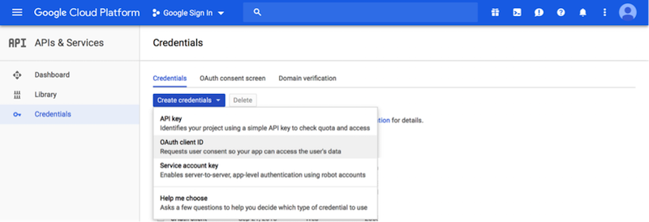

# Google Login

* Current Version: 1.0.0
* Last Updated: 01 October 2018
* License: [Commercial License][1]
* Compatibility: OpenCart 2.x, 3.x

[1]: https://www.marketinsg.com/usage-license

## Description

Get Google Login for your website. Allow customers to quickly sign up or login on your website with their Google (Gmail) account. Skip the hassle of remembering multiple passwords, all your customers need is their Google password, making it much easier to shop on your website. Our Google Login supports OpenCart multi-language and multi-store feature.

## Features

* Allow Google login on your store
* Allow user to create an account on your website in one click
* Does not override account details if user is already a customer
* Customisable button, heading, and display text
* Mobile responsive supported
* Multi language buttons and texts
* Multi store login supported
* Set Google registered customers to a specific customer group
* Set button alignment
* Optionally display a module box around the button
* Optionally display Google login button at specific target locations

## Installation

### OpenCart Cloud

1. Purchase the extension from your administration panel.
2. Proceed to `Extensions >> Extensions` and select `Modules`. Then, install `Google Login`. Configure extension accordingly.
3. Please view configuration details below.

### OpenCart 2 & 3

1. Go to `Admin >> Extensions >> Installer` to upload the extension zip file.
2. Proceed to `Extensions >> Extensions` and select `Modules`. Then, install `Google Login`. Configure extension accordingly.
3. Please view configuration details below.

## Upgrading

### All Versions

1. It is recommended to make a backup of your website before proceeding.
2. Follow the installation steps above to upgrade the extension. Files should be replaced.
3. Head over to the extension page and update any new configurations available.

## Configurations

### Getting Google Client ID

You will need a Google account to retreive your Google Client ID.

1. Proceed to https://console.cloud.google.com/apis.
2. Select "Credentials", followed by "Create Credentials".
3. Create a new "OAuth client ID".
4. For Application type, select "Web Application".
5. Enter a name for this credential. E.g. ('marketinsg.com').
6. Enter the URL for your website.
7. Upon saving, you should see your OAuth client ID. Copy everything up till ".apps.googleusercontent.com".

### OpenCart 2, 3 & Cloud

1. Adding Module to Layout

	Once you have installed and enabled the extension, you can add the extension to your layout through the OpenCart's layout management page.

## Change Log

### Version 1.0.0 (01/10/2018)
* Initial release