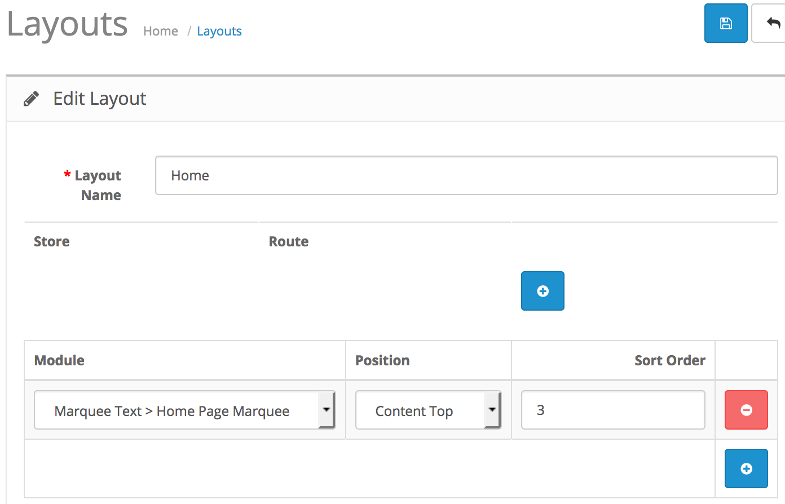

# Marquee Text

* Current Version: 2.0.0
* Last Updated: 02 July 2017
* License: [Commercial License][1]
* Compatibility: OpenCart 1.5.1.x, 1.5.2.x, 1.5.3.x, 1.5.4.x, 1.5.5.x, 1.5.6.x, 2.x, 3.x

[1]: https://www.marketinsg.com/usage-license

## Description

The old `<marquee>` tags in html are jumpy. This extension improves on the tag and your text will scroll smoothly. Additionally, you can now scroll in 4 directions instead of one single direction. Your customers wouldn’t be missing out on the attention grabbing text now! 

## Features

* Supports 4 directions scrolling (up, down, left, right)
* Custom scrolling speed
* Multi-language support
* Click to drag and move text

## Installation

### OpenCart Cloud

1. Purchase the extension from your administration panel.
2. Proceed to `Extensions >> Extensions` and select `Modules`. Then, install `Marquee Text`. Configure extension accordingly.
3. Please view configuration details below.

### OpenCart 3

1. Go to `Admin >> Extensions >> Installer` to upload the extension zip file.
2. Proceed to `Extensions >> Extensions` and select `Modules`. Then, install `Marquee Text`. Configure extension accordingly.
3. Please view configuration details below.

### OpenCart 1.5 & 2

1. Unzip the files.
2. Upload the files WITHIN the upload folder to your OpenCart installation folder with a FTP client. The folders should merge.
3. In your admin panel, proceed to `Extensions >> Modules`. Then, install `Marquee Text`. Configure extension accordingly.
4. Please view configuration details below.

## Configurations

### OpenCart 2, 3 & Cloud

1. Adding Module to Layout

	Once you have installed and enabled the extension, you can add the extension to your layout through the OpenCart's layout management page.

	

### OpenCart 1.5

1. Adding Module to Layout

	Once you have installed the extension, you can add the extension to your layout through the Marquee Text module settings page itself.

## Change Log

### Version 2.0.0 (02/07/2017)
* Fixed compatibility with OpenCart 3.0.0.0
* Minor improvements and updates
* Ceased support for OpenCart 1.5
### Version 1.2.6 (11/07/2016)
* Fixed compatibility with OpenCart 2.3.0.0
### Version 1.2.5 (04/03/2016)
* Fixed compatibility with OpenCart 2.2.0.0
### Version 1.2.4 (04/01/2016)
* Fixed missing top and bottom scroll directions for OC 2
### Version 1.2.3 (23/04/2015)
* OC 2.0.2.0 mail support compatibility fix
### Version 1.2.2 (12/02/2015)
* Bug fixes for OC 2
### Version 1.2.1 (22/12/2014)
* Update support Facebook link
### Version 1.2.0 (13/10/2014)
* OC 2 compatibility
### Version 1.1.0 (08/01/2013)
* Fixed compatibility with OpenCart 1.5.5.1