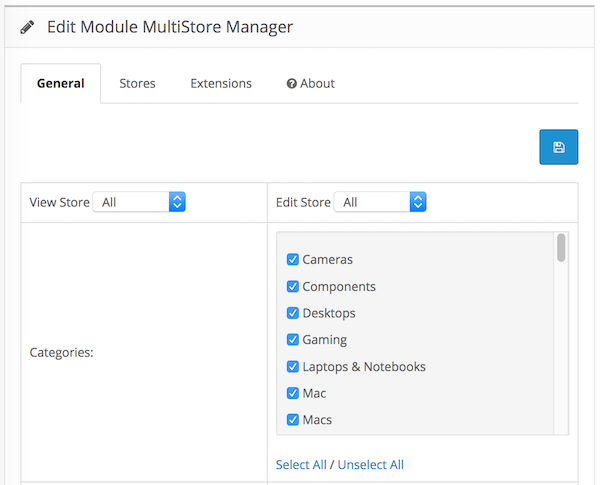

# MultiStore Manager

* Current Version: 3.0.0
* Last Updated: 03 July 2017
* License: [Commercial License][1]
* Compatibility: OpenCart 1.5.1.x, 1.5.2.x, 1.5.3.x, 1.5.4.x, 1.5.5.x, 1.5.6.x, 2.x, 3.x

[1]: https://www.marketinsg.com/usage-license

## Description

Multistore Manager allows you to assign all your products, categories, information pages, layouts, and manufacturers from stores to stores all on one single page. This will save you the trouble of needing to manually modify each of the layouts, products or categories whenever you create a new store. Additionally, you can restrict the shipping methods, payment methods, and order total modules to each individual store.

## Features

* Load the products, categories, information pages, manufacturers and layouts without needing to refresh the page.
* Assign your products, categories, information pages, manufacturers and layout from one single page to different stores.
* Allows you to track the products, categories, information pages, manufacturers and layouts assigned to the different stores in one single page.
* View all stores and their current selected template from one single list
* Allow selection of payment modules for different store
* Allow selection of shipping modules for different store
* Allow selection of order total modules for different store

## Installation

### OpenCart Cloud

1. Purchase the extension from your administration panel.
2. Proceed to `Extensions >> Extensions` and select `Modules`. Then, install `MultiStore Manager`. Configure extension accordingly.
3. Please view configuration details below.

### OpenCart 3

1. Go to `Admin >> Extensions >> Installer` to upload the extension zip file.
2. Proceed to `Extensions >> Extensions` and select `Modules`. Then, install `MultiStore Manager`. Configure extension accordingly.
3. Please view configuration details below.

### OpenCart 1.5 & 2

1. Unzip the files. Ensure that vQmod has been installed.
2. Upload the files WITHIN the upload folder to your OpenCart installation folder with a FTP client. The folders should merge.
3. In your admin panel, proceed to `Extensions >> Modules`. Then, install `MultiStore Manager`. Configure extension accordingly.
4. Please view configuration details below.

## Configurations

### OpenCart 1.5, 2, 3 & Cloud

1. View & Edit Feature

	`View` will display the list of categories, products, information, manufacturers, and layouts from the selected store. `Edit` will be the store you wish to update. Please select carefully and update accordingly.

	

2. Managing Extensions

	You will be able to turn on/off various payment modules, shipping modules and order total modules in the `Extensions` tab.

## Change Log

### Version 3.0.0 (03/07/2017)
* Fixed compatibility with OpenCart 3.0.0.0
* Minor improvements and updates
* Ceased support for OpenCart 1.5
### Version 2.2.5 (02/11/2016)
* Fixed redundant codes
### Version 2.2.4 (11/07/2016)
* Fixed compatibility with OpenCart 2.3.0.0
### Version 2.2.3 (04/03/2016)
* Updated installation manual
* Version number remains unchanged
### Version 2.2.3 (31/12/2015)
* Fixed issue with save button
### Version 2.2.2 (08/08/2015)
* Fixed wrong require_once file name
### Version 2.2.1 (04/07/2015)
* Minor bug fixes for OC 2
### Version 2.2.0 (17/06/2015)
* Minor admin aesthetic improvements
### Version 2.1.3 (23/04/2015)
* OC 2.0.2.0 mail support compatibility fix
### Version 2.1.2 (24/03/2015)
* Minor bug fixes
### Version 2.1.1 (22/12/2014)
* Update support Facebook link
### Version 2.1.0 (14/10/2014)
* OC 2 compatibility
### Version 2.0 (27/09/2013)
* Allow selection of payment modules for different store
* Allow selection of shipping modules for different store
* Allow selection of order total modules for different store
### Version 1.2 (26/08/2013)
* Allows user to view all stores and their selected template 
### Version 1.1 (07/07/2013)
* Rewrote module to support post limit
### Version 1.0
* Module created