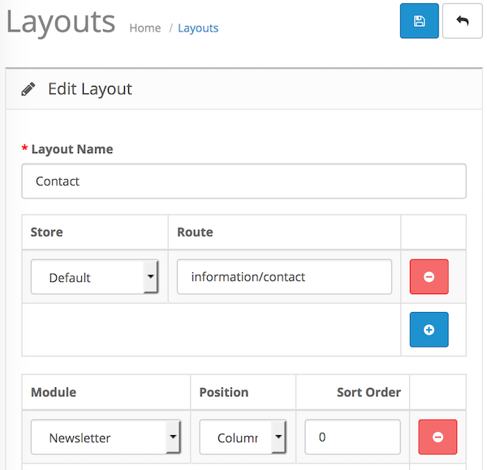
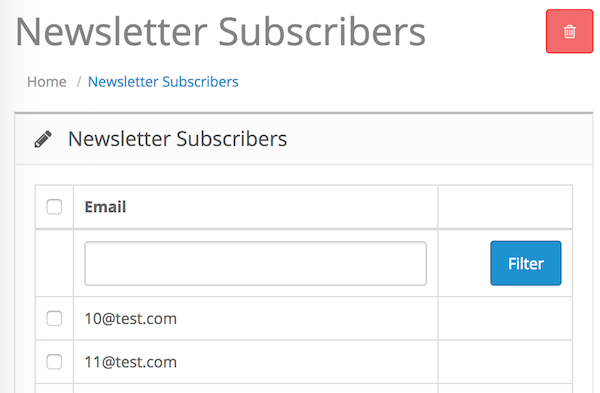

# Newsletter

* Current Version: 3.0.1
* Last Updated: 22 July 2017
* License: [Commercial License][1]
* Compatibility: OpenCart 1.5.1.x, 1.5.2.x, 1.5.3.x, 1.5.4.x, 1.5.5.x, 1.5.6.x, 2.x, 3.x

[1]: https://www.marketinsg.com/usage-license

## Description

This extension will allow you to place a newsletter subscribe module around your website. Your customers will be able to subscribe to your newsletter without the need of creating an account with this module.

## Features

* Subscribe to your newsletter without an account
* Validates if email is attached to an account.
* Automatically changes subscribe status of account for users with account
* Will not double send a newsletter to user with account and subscribed.
* Uses advance ajax technology to submit form (won’t redirect user away from page)
* Admin page to view all subscribers that subscribed through this module
* Able to send out newsletter with unsubscribe link

## Installation

### OpenCart Cloud

1. Purchase the extension from your administration panel.
2. Proceed to `Extensions >> Extensions` and select `Modules`. Then, install `Newsletter`. Configure extension accordingly.
3. Please view configuration details below.

### OpenCart 3

1. Go to `Admin >> Extensions >> Installer` to upload the extension zip file.
2. Proceed to `Extensions >> Extensions` and select `Modules`. Then, install `Newsletter`. Configure extension accordingly.
3. Please view configuration details below.

### OpenCart 1.5 & 2

1. Unzip the files.
2. Upload the files WITHIN the upload folder to your OpenCart installation folder with a FTP client. The folders should merge.
3. In your admin panel, proceed to `Extensions >> Modules`. Then, install `Newsletter`. Configure extension accordingly.
4. Please view configuration details below.

## Configurations

### OpenCart 2, 3 & Cloud

1. Adding Module to Layout

	Once you have installed and enabled the extension, you can add the extension to your layout through the OpenCart's layout management page.

	

2. Viewing Subscribers

	You can view the subscribers on your website through the newsletter subscribers page, which can be found in `Extensions >> Newsletter Subscribers`. Only subscribers that are not registered on your website will be shown here.

	

### OpenCart 1.5

1. Adding Module to Layout

	Once you have installed the extension, you can add the extension to your layout through the Mega Menu module settings page itself.

2. Viewing Subscribers

	You can view the subscribers on your website through the newsletter subscribers page, which can be found in `Extensions >> Newsletter Subscribers`. Only subscribers that are not registered on your website will be shown here.

	

## Change Log

### Version 3.0.1 (22/07/2017)
* Fixed incorrect unsubscribe link for OpenCart 2.3 and 3 release
### Version 3.0.0 (03/07/2017)
* Fixed compatibility with OpenCart 3.0.0.0
* Minor improvements and updates
* Ceased support for OpenCart 1.5
### Version 2.5.6 (11/07/2016)
* Fixed compatibility with OpenCart 2.3.0.0
### Version 2.5.5 (24/05/2016)
* Fixed newsletter unsubscribe page for OpenCart 2 release 
### Version 2.5.4 (18/04/2016)
* Added missing pagination for OpenCart 2 release
### Version 2.5.3 (04/03/2016)
* Fixed compatibility with OpenCart 2.2.0.0
### Version 2.5.2 (28/02/2016)
* Fixed minor bug for OC 1.5 release 
### Version 2.5.1 (13/12/2015)
* Fixed wrong unsubscribe link being sent
### Version 2.5.0 (16/05/2015)
* Minor admin aesthetic improvements
### Version 2.4.3 (23/04/2015)
* OC 2.0.2.0 mail support compatibility fix
### Version 2.4.2 (10/02/2015)
* Bug fixes for OC 2
### Version 2.4.1 (22/12/2014)
* Update support Facebook link
### Version 2.4.0 (14/10/2014)
* OC 2 compatibility
### Version 2.3.0 (17/04/2014)
* Supports unsubscribe link in newsletter
### Version 2.2.0 (04/03/2013)
* Allows enter button to submit form
### Version 2.1.0 (08/01/2013)
* OpenCart v1.5.5 compatibility
### Version 2.0.0 (08/12/2012)
* Newsletter subscribers list in admin panel