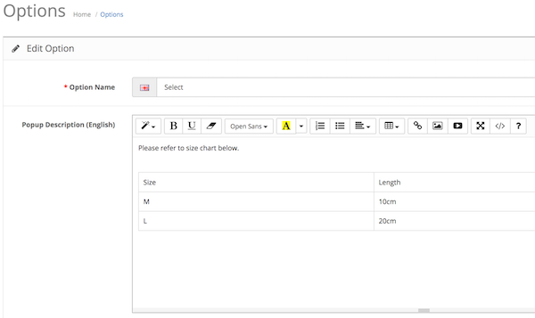

# Option Description

* Current Version: 2.0.0
* Last Updated: 04 July 2017
* License: [Commercial License][1]
* Compatibility: OpenCart 1.5.1.x, 1.5.2.x, 1.5.3.x, 1.5.4.x, 1.5.5.x, 1.5.6.x, 2.x, 3.x

[1]: https://www.marketinsg.com/usage-license

## Description

Many customers need more description about the option they are selecting when adding products to cart. This extension will do just that, allowing you to add a description to each of the options. 

## Features

* Add description to options
* Rich text editor for entering description
* Multi-language description supported
* Displays description in a popup when option name is clicked

## Installation

### OpenCart Cloud

1. Purchase the extension from your administration panel.
2. Proceed to `Extensions >> Extensions` and select `Modules`. Then, install `Option Description`. Configure extension accordingly.
3. Proceed to `Extensions >> Modifications` and click the blue refresh button.
4. Please view configuration details below.

### OpenCart 3

1. Go to `Admin >> Extensions >> Installer` to upload the extension zip file.
2. Proceed to `Extensions >> Extensions` and select `Modules`. Then, install `Option Description`. Configure extension accordingly.
3. Proceed to `Extensions >> Modifications` and click the blue refresh button.
4. Please view configuration details below.

### OpenCart 1.5 & 2

1. Unzip the files. Ensure that vQmod has been installed.
2. Upload the files WITHIN the upload folder to your OpenCart installation folder with a FTP client. The folders should merge.
3. In your admin panel, proceed to `Extensions >> Modules`. Then, install `Option Description`. Configure extension accordingly.
4. Please view configuration details below.

## Configurations

### OpenCart 1.5, 2, 3 & Cloud

1. Setting Option Description

	Option description can be configured in `Catalog >> Options >> Edit Option`. A text editor will be shown for each language installed on your website.

	

## Change Log

### Version 2.0.0 (04/07/2017)
* Fixed compatibility with OpenCart 3.0.0.0
* Minor improvements and updates
* Ceased support for OpenCart 1.5
### Version 1.0.1 (11/07/2016)
* Fixed compatibility with OpenCart 2.3.0.0
### Version 1.0.0 (04/03/2016)
* Updated installation manual
* Version number remains unchanged
### Version 1.0.0 (03/02/2016)
* Extension created