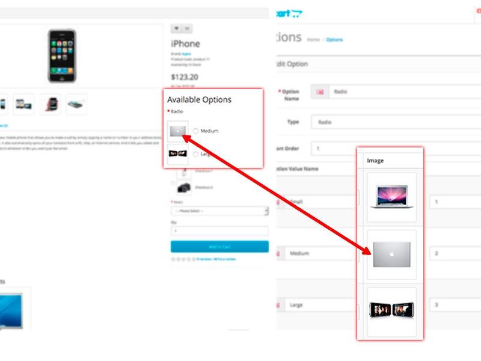
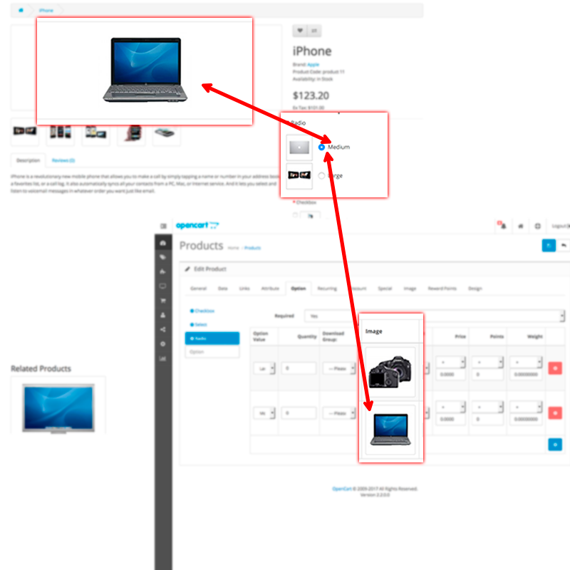

# Dependent Options

* Current Version: 5.0.1
* Last Updated: 04 September 2017
* License: [Commercial License][1]
* Compatibility: OpenCart 1.5.1.x, 1.5.2.x, 1.5.3.x, 1.5.4.x, 1.5.5.x, 1.5.6.x, 2.x, 3.x

[1]: https://www.marketinsg.com/usage-license

## Description

Option Image allows you to display images next to your options, and it changes the main image when you click on an option value. Images can be added to drop down list, radio buttons, and check boxes.

## Features

* Adds images to product options
* Main image changes by clicking on option values
* Option image plus allows you to set a second option image at the product option
* 100% new files

## Installation

### OpenCart Cloud

1. Purchase the extension from your administration panel.
2. Proceed to `Extensions >> Extensions` and select `Modules`. Then, install `Option Image`. Configure extension accordingly.
3. Proceed to `Extensions >> Modifications` and click the blue refresh button.
4. Please view configuration details below.

### OpenCart 3

1. Go to `Admin >> Extensions >> Installer` to upload the extension zip file.
2. Proceed to `Extensions >> Extensions` and select `Modules`. Then, install `Option Image`. Configure extension accordingly.
3. Proceed to `Extensions >> Modifications` and click the blue refresh button.
4. Please view configuration details below.

### OpenCart 1.5 & 2

1. Unzip the files. Ensure that vQmod has been installed.
2. Upload the files WITHIN the upload folder to your OpenCart installation folder with a FTP client. The folders should merge.
3. In your admin panel, proceed to `Extensions >> Modules`. Then, install `Option Image`. Configure extension accordingly.
4. Please view configuration details below.

## Configurations

### OpenCart 1.5, 2, 3 & Cloud

1. Setting Option Value Small Thumbnail Images

	Add images to the option values in `Catalog >> Options >> Edit Options`. The image added here will be used for the small option thumbnail on the store front. `select` type option will not show this small thumbnail.

	

2. Setting Main Option Value Image (Option Image Plus)

	Proceed to `Catalog >> Products >> Edit Product >> Options Tab` and add the options to the product. Set the option value image here if you are using Option Image Plus. If you are using Option Image, the small thumbnail image will be the main image shown.

	

## Change Log

### Version 5.0.1 (04/09/2017)
* Fixed incorrect OCMod script for OpenCart 3.0.0 release

### Version 5.0.0 (04/07/2017)
* Fixed compatibility with OpenCart 3.0.0.0
* Minor improvements and updates
* Ceased support for OpenCart 1.5

### Version 4.3.2 (11/07/2016)
* Fixed compatibility with OpenCart 2.3.0.0

### Version 4.3.1 (04/03/2016)
* Improved script for easier integration with custom themes
* Fixed compatibility with OpenCart 2.2.0.0

### Version 4.3.0 (18/05/2015)
* Improved administration interface

### Version 4.2.2 (23/04/2015)
* Fixed compatibility with OpenCart 2.0.2.0 mail

### Version 4.2.1 (22/12/2014)
* Fixed Facebook support link

### Version 4.2.0 (14/10/2014)
* Fixed compatibility with OpenCart 2.0.0.0

### Version 4.1.1 (19/04/2014)
* Improved codes

### Version 4.1.0 (08/01/2013)
* OpenCart v1.5.5 compatibility

### Version 4.0.0 (01/12/2012)
* Installation Improvements for Option Image

### Version 3.1.0 (17/10/2012)
* Bug fixes for Option Image Plus 

### Version 3.0.0 (03/10/2012)
* Added Option Image Plus