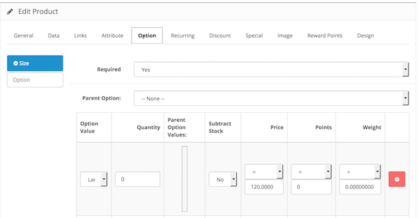

# Option Value Equals Sign

* Current Version: 2.0.0
* Last Updated: 05 July 2017
* License: [Commercial License][1]
* Compatibility: OpenCart 1.5.1.x, 1.5.2.x, 1.5.3.x, 1.5.4.x, 1.5.5.x, 1.5.6.x, 2.x, 3.x

[1]: https://www.marketinsg.com/usage-license

## Description

Option Value Equals Sign allows you to set an equal sign for your price, weight, and reward points for your option values. The default OpenCart option values can only have a plus and minus sign, and this modification would just be the thing you need if you want an equal sign.

This extension also works with our Live Price Update extension.

## Features

* Add an equal sign for your product option values
* Equal sign for option value price
* Equal sign for option value reward points
* Equal sign for option value weight
* Works with all custom themes

## Installation

### OpenCart Cloud

1. Purchase the extension from your administration panel.
2. Proceed to `Extensions >> Extensions` and select `Modules`. Then, install `Option Value Equals Sign`. Configure extension accordingly.
3. Proceed to `Extensions >> Modifications` and click the blue refresh button.
4. Please view configuration details below.

### OpenCart 3

1. Go to `Admin >> Extensions >> Installer` to upload the extension zip file.
2. Proceed to `Extensions >> Extensions` and select `Modules`. Then, install `Option Value Equals Sign`. Configure extension accordingly.
3. Proceed to `Extensions >> Modifications` and click the blue refresh button.
4. Please view configuration details below.

### OpenCart 1.5 & 2

1. Unzip the files. Ensure that vQmod has been installed.
2. Upload the files WITHIN the upload folder to your OpenCart installation folder with a FTP client. The folders should merge.
3. In your admin panel, proceed to `Extensions >> Modules`. Then, install `Option Value Equals Sign`. Configure extension accordingly.
4. Please view configuration details below.

## Configurations

### OpenCart 1.5, 2, 3 & Cloud

1. Setting Equal Sign

	You can configure the equal sign for your option values in `Catalog >> Product >> Edit Product >> Option` tab.

	

## Change Log

### Version 2.0.0 (05/07/2017)
* Fixed compatibility with OpenCart 3.0.0.0
* Minor improvements and updates
* Ceased support for OpenCart 1.5
### Version 1.1.5 (11/07/2016)
* Fixed compatibility with OpenCart 2.3.0.0
### Version 1.1.4 (04/03/2016)
* Fixed compatibility with OpenCart 2.2.0.0
### Version 1.1.3 (20/01/2016)
* Fixed for OC 2.1.x releases
### Version 1.1.2 (16/08/2015)
* Fixed allow equal sign to be mixed with other signs
### Version 1.1.1 (24/05/2015)
* Fixed wrong file path
### Version 1.1.0 (15/05/2015)
* Minor bug fixes