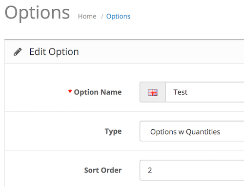

# Options with Quantities

* Current Version: 3.0.0
* Last Updated: 05 July 2017
* License: [Commercial License][1]
* Compatibility: OpenCart 1.5.1.x, 1.5.2.x, 1.5.3.x, 1.5.4.x, 1.5.5.x, 1.5.6.x, 2.x, 3.x

[1]: https://www.marketinsg.com/usage-license

## Description

Options with Quantities allow your customers to shop quickly. They can add multiple quantities of different options choices to their cart in just one single click. This modification will give each option value a quantity box.

## Features

* Able to use multiple ‘Options with Quantities’ together
* Able to mix options type (e.g. Use Select Type options + Options w Quantities)
* Add quantity box to each option value
* Add new option type – Options w Quantities
* Does not replace default option types
* Only affects products that use ‘Options w Quantities’ for their option.
* Removes ‘Price’ field as that will be confusing
* Removes default ‘Quantity’ box as that will be confusing
* Simple installation

## Installation

### OpenCart Cloud

1. Purchase the extension from your administration panel.
2. Proceed to `Extensions >> Extensions` and select `Modules`. Then, install `Options with Quantities`. Configure extension accordingly.
3. Proceed to `Extensions >> Modifications` and click the blue refresh button.
4. Please view configuration details below.

### OpenCart 3

1. Go to `Admin >> Extensions >> Installer` to upload the extension zip file.
2. Proceed to `Extensions >> Extensions` and select `Modules`. Then, install `Options with Quantities`. Configure extension accordingly.
3. Proceed to `Extensions >> Modifications` and click the blue refresh button.
4. Please view configuration details below.

### OpenCart 1.5 & 2

1. Unzip the files. Ensure that vQmod has been installed.
2. Upload the files WITHIN the upload folder to your OpenCart installation folder with a FTP client. The folders should merge.
3. In your admin panel, proceed to `Extensions >> Modules`. Then, install `Options with Quantities`. Configure extension accordingly.
4. Please view configuration details below.

## Configurations

### OpenCart 1.5, 2, 3 & Cloud

1. New Option Type - Options w Quantities

	You should now be able to find the new option type in `Catalog >> Options >> Edit Option`.

	

## Change Log

### Version 3.0.0 (05/07/2017)
* Fixed compatibility with OpenCart 3.0.0.0
* Minor improvements and updates
* Ceased support for OpenCart 1.5
### Version 2.6.6 (11/07/2016)
* Fixed compatibility with OpenCart 2.3.0.0
### Version 2.6.5 (07/03/2016)
* Fixed compatibility with OpenCart 2.2.0.0
### Version 2.6.4 (05/09/2015)
* Fixed table ID (OC 2)
* Support for Option Value Equals Sign
### Version 2.6.3 (16/08/2015)
* Fix issue with options disappearing when editing order (OC 2)
### Version 2.6.2 (04/06/2015)
* Bug fix for OC 2.0.3.0
### Version 2.6.1 (18/05/2015)
* Bug fix for controller class not found (OC 2)
### Version 2.6.0 (17/05/2015)
* Minor admin aesthetic improvements
### Version 2.5.1 (22/02/2015)
* OC 2.0.2.0 compatibility
### Version 2.5.0 (14/10/2014)
* Fixed compatibility with OpenCart 2.0.0.0
### Version 2.4.1 (23/04/2014)
* Fixed minor bugs