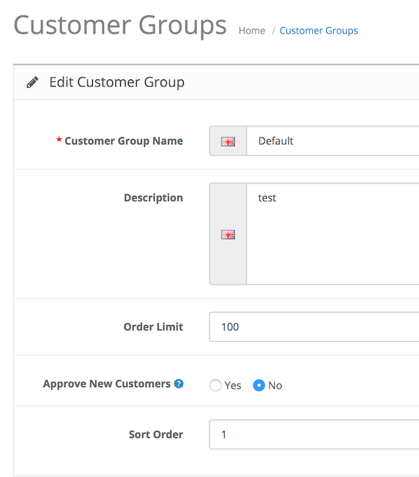

# Order Limitation

* Current Version: 2.0.0
* Last Updated: 05 July 2017
* License: [Commercial License][1]
* Compatibility: OpenCart 1.5.1.x, 1.5.2.x, 1.5.3.x, 1.5.4.x, 1.5.5.x, 1.5.6.x, 2.x, 3.x

[1]: https://www.marketinsg.com/usage-license

## Description

If you need a way to limit the number of orders a specific customer group on your store can make, this is exactly what you need! Order Limitation allows you to limit the number of orders each customer from the specific customer group can make on your store within X days.

## Features

* Limit orders based on customer group
* Limit orders for customers with an account only
* Set a variable date length to limit across the store

## Installation

### OpenCart Cloud

1. Purchase the extension from your administration panel.
2. Proceed to `Extensions >> Extensions` and select `Modules`. Then, install `Order Limitation`. Configure extension accordingly.
3. Proceed to `Extensions >> Modifications` and click the blue refresh button.
4. Please view configuration details below.

### OpenCart 3

1. Go to `Admin >> Extensions >> Installer` to upload the extension zip file.
2. Proceed to `Extensions >> Extensions` and select `Modules`. Then, install `Order Limitation`. Configure extension accordingly.
3. Proceed to `Extensions >> Modifications` and click the blue refresh button.
4. Please view configuration details below.

### OpenCart 1.5 & 2

1. Unzip the files. Ensure that vQmod has been installed.
2. Upload the files WITHIN the upload folder to your OpenCart installation folder with a FTP client. The folders should merge.
3. In your admin panel, proceed to `Extensions >> Modules`. Then, install `Order Limitation`. Configure extension accordingly.
4. Please view configuration details below.

## Configurations

### OpenCart 1.5, 2, 3 & Cloud

1. Configuring Order Limitation

	You can configure the limitation for each individual customer group in the customer group management page as per below.

	

## Change Log

### Version 2.0.0 (05/07/2017)
* Fixed compatibility with OpenCart 3.0.0.0
* Minor improvements and updates
* Ceased support for OpenCart 1.5
### Version 1.2.1 (12/07/2016)
* Fixed compatibility with OpenCart 2.3.0.0
### Version 1.2.0 (09/03/2016)
* Improved administration interface
### Version 1.1.4 (10/10/2015)
* Fixed compatibility with OpenCart 2.1.0.0
### Version 1.1.3 (23/04/2015)
* OC 2.0.2.0 mail support compatibility fix
### Version 1.1.2 (10/02/2015)
* Bug fixes for OC 2
### Version 1.1.1 (22/12/2014)
* Update support Facebook link
### Version 1.1.0 (14/10/2014)
* OC 2 compatibility
* Limit to include more than or equal to
### Version 1.0.0 (04/02/2014)
* Module created