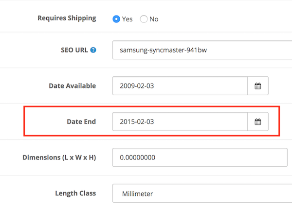

# Option Value Equals Sign

* Current Version: 2.0.0
* Last Updated: 10 July 2017
* License: [Commercial License][1]
* Compatibility: OpenCart 1.5.1.x, 1.5.2.x, 1.5.3.x, 1.5.4.x, 1.5.5.x, 1.5.6.x, 2.x, 3.x

[1]: https://www.marketinsg.com/usage-license

## Description

Do you need to remove certain products after a certain date? This extension will do just what you need. Configure your products to end after the set date you have configured.

## Features

* Set a ‘date end’ for your products
* Products will end automatically when expired
* Product page will still be available by accessing page directly, but cannot be added to cart

## Installation

### OpenCart Cloud

1. Purchase the extension from your administration panel.
2. Proceed to `Extensions >> Extensions` and select `Modules`. Then, install `Product Date End`. Configure extension accordingly.
3. Proceed to `Extensions >> Modifications` and click the blue refresh button.
4. Please view configuration details below.

### OpenCart 3

1. Go to `Admin >> Extensions >> Installer` to upload the extension zip file.
2. Proceed to `Extensions >> Extensions` and select `Modules`. Then, install `Product Date End`. Configure extension accordingly.
3. Proceed to `Extensions >> Modifications` and click the blue refresh button.
4. Please view configuration details below.

### OpenCart 1.5 & 2

1. Unzip the files. Ensure that vQmod has been installed.
2. Upload the files WITHIN the upload folder to your OpenCart installation folder with a FTP client. The folders should merge.
3. In your admin panel, proceed to `Extensions >> Modules`. Then, install `Product Date End`. Configure extension accordingly.
4. Please view configuration details below.

## Configurations

### OpenCart 1.5, 2, 3 & Cloud

1. Setting Equal Sign

	You can configure the product date end feature in `Catalog >> Product >> Edit Product >> Data` tab.

	

## Change Log

### Version 2.0.0 (10/07/2017)
* Fixed compatibility with OpenCart 3.0.0.0
* Minor improvements and updates
* Ceased support for OpenCart 1.5
### Version 1.1.2 (12/07/2016)
* Fixed compatibility with OpenCart 2.3.0.0
### Version 1.1.1 (01/04/2016)
* Fixed compatibility with OpenCart 2.2.0.0
### Version 1.1.0 (10/03/2016)
* Added administration interface for installation
### Version 1.0.1 (10/10/2015)
* Fixed minor bugs for OpenCart 2
* Set default date end to be 10 years
### Version 1.0.0 (28/01/2015)
* Module created