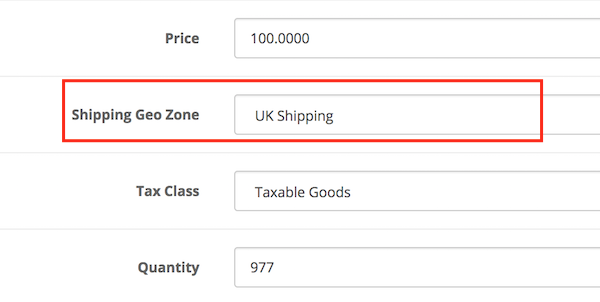

# Product Geo Zone

* Current Version: 2.0.0
* Last Updated: 10 July 2017
* License: [Commercial License][1]
* Compatibility: OpenCart 1.5.1.x, 1.5.2.x, 1.5.3.x, 1.5.4.x, 1.5.5.x, 1.5.6.x, 2.x, 3.x

[1]: https://www.marketinsg.com/usage-license

## Description

Product Geo Zone allows you to limit the shipping location of certain products in your store.

For example, if you only ship product X within your country, but the rest of your products in store can be shipped across the world, you will use this extension to limit the location product X can be shipped to using the OpenCart Geo Zones feature. It will prevent your customer from checking out if the product cannot be shipped to their location.

## Features

* Limit products to certain geo zones
* Prevent checking out if product cannot be shipped to the location

## Installation

### OpenCart Cloud

1. Purchase the extension from your administration panel.
2. Proceed to `Extensions >> Extensions` and select `Modules`. Then, install `Product Geo Zone`. Configure extension accordingly.
3. Proceed to `Extensions >> Modifications` and click the blue refresh button.
4. Please view configuration details below.

### OpenCart 3

1. Go to `Admin >> Extensions >> Installer` to upload the extension zip file.
2. Proceed to `Extensions >> Extensions` and select `Modules`. Then, install `Product Geo Zone`. Configure extension accordingly.
3. Proceed to `Extensions >> Modifications` and click the blue refresh button.
4. Please view configuration details below.

### OpenCart 1.5 & 2

1. Unzip the files. Ensure that vQmod has been installed.
2. Upload the files WITHIN the upload folder to your OpenCart installation folder with a FTP client. The folders should merge.
3. In your admin panel, proceed to `Extensions >> Modules`. Then, install `Product Geo Zone`. Configure extension accordingly.
4. Please view configuration details below.

## Configurations

### OpenCart 1.5, 2, 3 & Cloud

1. Configuring Geo Zones

	You can setup Geo Zones in `System >> Localisation >> Geo Zones`. Multiple countries can be added into a single Geo Zone. Once that is done, you can link up the geo zones to the products.

2. Limiting Products to Geo Zone

	You can configure the product's geo zone in `Catalog >> Product >> Edit Product >> Data` tab. Once linked, the product will be restricted to the geo zone configured.

	

## Change Log

### Version 2.0.0 (10/07/2017)
* Fixed compatibility with OpenCart 3.0.0.0
* Minor improvements and updates
* Ceased support for OpenCart 1.5
### Version 1.1.2 (26/01/2017)
* Added validation at shipping method step
### Version 1.1.1 (12/07/2016)
* Fixed compatibility with OpenCart 2.3.0.0
### Version 1.1.0 (10/03/2016)
* Added administration interface for installation