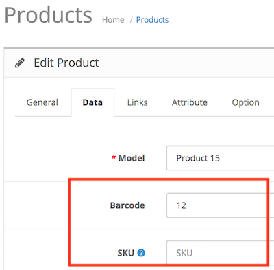
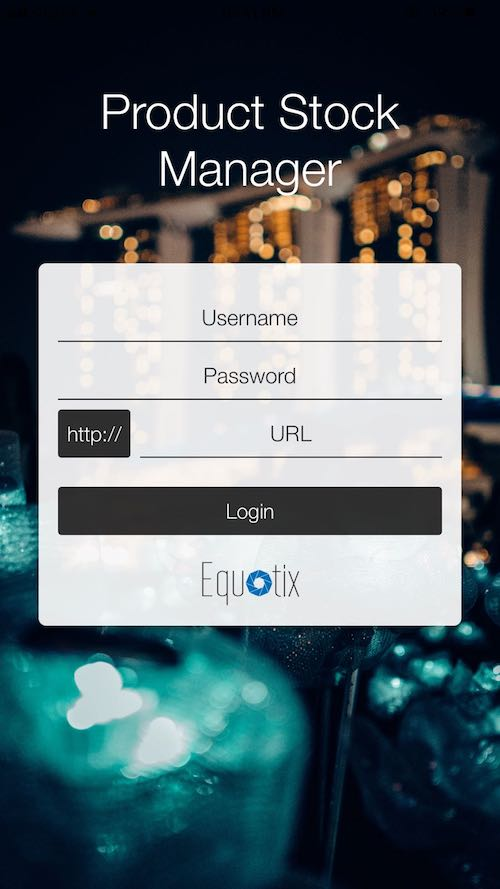
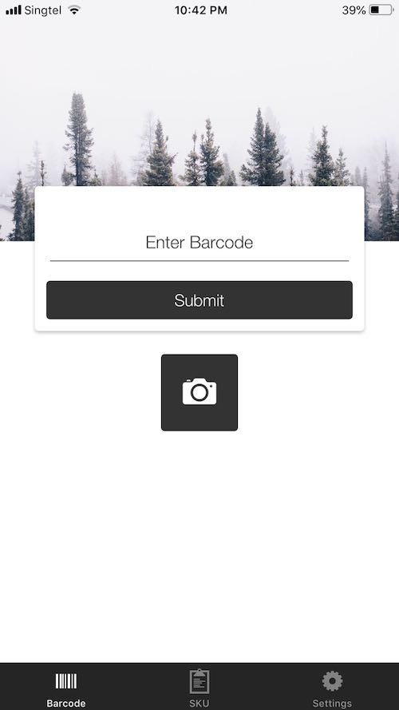

# Product Stock Mobile App

* Current Version: 2.1.0
* Last Updated: 11 May 2018
* License: [Commercial License][1]
* Compatibility: OpenCart 1.5.1.x, 1.5.2.x, 1.5.3.x, 1.5.4.x, 1.5.5.x, 1.5.6.x, 2.x, 3.x

[1]: https://www.marketinsg.com/usage-license

## Description

Product Stock Mobile Application allows you to link your OpenCart store to our mobile app. The mobile app will allow you to scan your product’s barcode or enter its SKU to update the product (quantity, price & status). A barcode list can also be generated from the store administration panel.

## Features

* Android & iOS mobile application
* Enter barcode for products from your admin panel
* Enter barcode / SKU for each product option value
* Update product / option value stock quantity from mobile application
* Update product / option value price from mobile application
* Update product status from mobile application
* Barcode scanner for Android and iOS mobile application

## Installation

### OpenCart Cloud

1. Purchase the extension from your administration panel.
2. Proceed to `Extensions >> Extensions` and select `Modules`. Then, install `Product Stock Mobile Application`. Configure extension accordingly.
3. Proceed to `Extensions >> Modifications` and click the blue refresh button.
4. Download the Android mobile application from the Google Play Store or the iOS mobile application from the Apple App Store. Do a search for ‘OpenCart Product Stock’ by Equotix.
5. Please view configuration details below.

### OpenCart 3

1. Go to `Admin >> Extensions >> Installer` to upload the extension zip file.
2. Proceed to `Extensions >> Extensions` and select `Modules`. Then, install `Product Stock Mobile Application`. Configure extension accordingly.
3. Proceed to `Extensions >> Modifications` and click the blue refresh button.
4. Download the Android mobile application from the Google Play Store or the iOS mobile application from the Apple App Store. Do a search for ‘OpenCart Product Stock’ by Equotix.
5. Please view configuration details below.

### OpenCart 1.5 & 2

1. Unzip the files. Ensure that vQmod has been installed.
2. Upload the files WITHIN the upload folder to your OpenCart installation folder with a FTP client. The folders should merge.
3. In your admin panel, proceed to `Extensions >> Modules`. Then, install `Product Stock Mobile Application`. Configure extension accordingly.
4. Download the Android mobile application from the Google Play Store or the iOS mobile application from the Apple App Store. Do a search for ‘OpenCart Product Stock’ by Equotix.
5. Please view configuration details below.

## Configurations

### OpenCart 1.5, 2, 3 & Cloud

1. Configuring Barcode or SKU

	You can mass generate barcodes for your products and options in our extension settings. Alternatively, you can configure the SKU or barcode in `Catalog >> Products >> Edit Product >> Data` tab. For options with option values, it can be configured in the `Option` tab.

	

2. Using the Mobile Application

	__Logging into the Application__

	You can start using the mobile application once you login. Login to your store admin by entering your store admin URL, username and password.

	

	__Scan a Barcode or Enter a SKU__

	Scan a barcode or enter a SKU to begin updating a product. You will be able to update the product price, quantity or status through the mobile application.

	

## Change Log

### Version 2.1.0 (11/05/2018)
* Fixed minor issues with OpenCart 3
* Added image URL for API to support latest app updates
* Code improvements and maintenance
### Version 2.0.0 (10/07/2017)
* Fixed compatibility with OpenCart 3.0.0.0
* Minor improvements and updates
* Ceased support for OpenCart 1.5
### Version 1.1.4 (12/02/2017)
* Fixed permission issue for OpenCart 2.3 releases
### Version 1.1.3 (24/10/2016)
* Fixed compatibility with OpenCart 2.2.0.0 due to previous release
### Version 1.1.2 (12/07/2016)
* Fixed compatibility with OpenCart 2.3.0.0
* Improved mobile application
### Version 1.1.1 (13/04/2016)
* Fixed undefined currency error
### Version 1.1.0 (10/03/2016)
* Fixed compatibility with OpenCart 2.2.0.0
* Updated administration interface
### Version 1.0.0 (22/04/2015)
* Module released