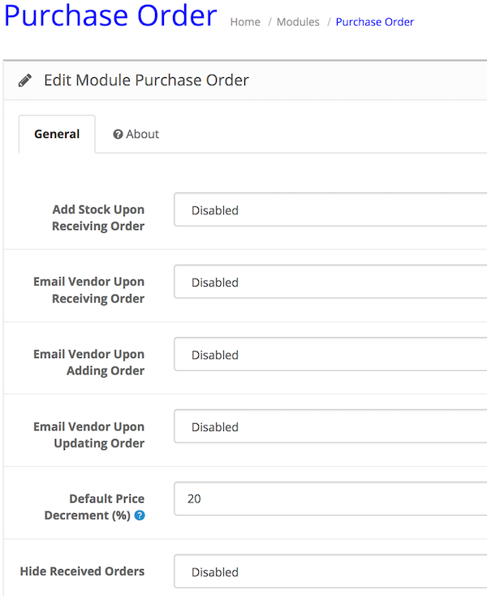
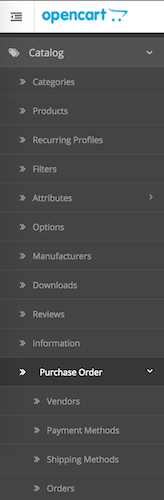

# Purchase Order

* Current Version: 2.0.0
* Last Updated: 10 July 2017
* License: [Commercial License][1]
* Compatibility: OpenCart 1.5.1.x, 1.5.2.x, 1.5.3.x, 1.5.4.x, 1.5.5.x, 1.5.6.x, 2.x, 3.x

[1]: https://www.marketinsg.com/usage-license

## Description

Purchase Order allows you to easily coordinate your purchase orders with your vendors through your administration panel. Skip the hassle of manually submitting your purchase orders to your vendors.

## Features

* Add custom vendors
* Add custom payment methods
* Add custom shipping methods
* Add purchase orders
* Print orders
* Optional automated stock update upon receiving order
* Optional automated email vendor upon receiving order
* Emails vendors upon adding orders
* Set optional product cost on product
* Set optional product model on product
* Set optional product title on product
* Support product options
* Able to populate products for Purchase Order based on selected vendor
* Able to populate options combinations for each product
* Able to hide received orders from listing

## Installation

### OpenCart Cloud

1. Purchase the extension from your administration panel.
2. Proceed to `Extensions >> Extensions` and select `Modules`. Then, install `Purchase Order`. Configure extension accordingly.
3. Proceed to `Extensions >> Modifications` and click the blue refresh button.
4. Please view configuration details below.

### OpenCart 3

1. Go to `Admin >> Extensions >> Installer` to upload the extension zip file.
2. Proceed to `Extensions >> Extensions` and select `Modules`. Then, install `Purchase Order`. Configure extension accordingly.
3. Proceed to `Extensions >> Modifications` and click the blue refresh button.
4. Please view configuration details below.

### OpenCart 1.5 & 2

1. Unzip the files. Ensure that vQmod has been installed.
2. Upload the files WITHIN the upload folder to your OpenCart installation folder with a FTP client. The folders should merge.
3. In your admin panel, proceed to `Extensions >> Modules`. Then, install `Purchase Order`. Configure extension accordingly.
4. Please view configuration details below.

## Configurations

### OpenCart 1.5, 2, 3 & Cloud

1. Module Configurations

	Basic configurations for the extension is located within the module, which can be found in `Extensions >> Modules >> Purchase Order`.

	

2. Adding Payment Methods, Shipping Methods and Vendors

	Get started by adding payment methods, shipping methods and vendors, which can be accessed through the `Catalog` menu.

	

3. Adding Purchase Orders

	You can begin adding purchase orders into the system and start using the extension once the above has been configured. The purchase orders page can be accessed through the `Catalog` menu as well.

## Change Log

### Version 2.0.0 (10/07/2017)
* Fixed compatibility with OpenCart 3.0.0.0
* Minor improvements and updates
* Ceased support for OpenCart 1.5
### Version 1.3.8 (12/07/2016)
* Fixed compatibility with OpenCart 2.3.0.0
### Version 1.3.7 (13/04/2016)
* Fixed issues with undefined currency
### Version 1.3.6 (27/03/2016)
* Fixed issues with sending email
### Version 1.3.5 (07/03/2016)
* Fixed compatibility with OpenCart 2.2.0.0
### Version 1.3.4 (12/01/2016)
* Fixed zone list not loading up on newer OC 2 releases
### Version 1.3.3 (13/12/2015)
* Fixed quantity not removed when user uncheck ‘received’
### Version 1.3.2 (05/06/2015)
* Fixed issue with date picker not working properly (OC 2)
### Version 1.3.1 (04/06/2015)
* Fixed issue with multiple rows of same results
* Fixed issue with search filter
### Version 1.3.0 (19/05/2015)
* Minor admin aesthetic improvements
### Version 1.2.1 (23/04/2015)
* OC 2.0.2.0 mail support compatibility fix
### Version 1.2.0 (24/03/2015)
* Added purchase order filter function
### Version 1.1.2 (06/02/2015)
* Bug fixes
### Version 1.1.1 (23/12/2014)
* Update support Facebook link
### Version 1.1.0 (27/10/2014)
* OC 2 compatibility
### Version 1.0.1 (05/05/2014)
* Minor bug fix
### Version 1.0.0 (11/03/2014)
* Module released