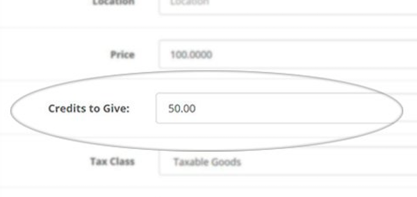

# Purchase Store Credits

* Current Version: 2.0.0
* Last Updated: 11 July 2017
* License: [Commercial License][1]
* Compatibility: OpenCart 1.5.1.x, 1.5.2.x, 1.5.3.x, 1.5.4.x, 1.5.5.x, 1.5.6.x, 2.x, 3.x

[1]: https://www.marketinsg.com/usage-license

## Description

Do you want to allow your customers to purchase store credits? Sell your store credits just like how gift vouchers work on OpenCart with this extension.

## Features

* Configure products to give store credits
* Store credits cannot be used to purchase store credits

## Installation

### OpenCart Cloud

1. Purchase the extension from your administration panel.
2. Proceed to `Extensions >> Extensions` and select `Modules`. Then, install `Purchase Store Credits`. Configure extension accordingly.
3. Proceed to `Extensions >> Modifications` and click the blue refresh button.
4. Popup notification will now show up when a product is added.

### OpenCart 3

1. Go to `Admin >> Extensions >> Installer` to upload the extension zip file.
2. Proceed to `Extensions >> Extensions` and select `Modules`. Then, install `Purchase Store Credits`. Configure extension accordingly.
3. Proceed to `Extensions >> Modifications` and click the blue refresh button.
4. Popup notification will now show up when a product is added.

### OpenCart 1.5 & 2

1. Unzip the files. Ensure that vQmod has been installed.
2. Upload the files WITHIN the upload folder to your OpenCart installation folder with a FTP client. The folders should merge.
3. In your admin panel, proceed to `Extensions >> Modules`. Then, install `Purchase Store Credits`. Configure extension accordingly.
4. Popup notification will now show up when a product is added.

## Configurations

### OpenCart 1.5, 2, 3 & Cloud

1. Configuring Products with Credits

You can assign credits in the product form. Upon assigning the products, if a customer purchases the product, the customer will receive the credits you have assigned.

## Change Log

### Version 2.0.0 (11/07/2017)
* Fixed compatibility with OpenCart 3.0.0.0
* Minor improvements and updates
* Ceased support for OpenCart 1.5
### Version 1.0.3 (10/11/2016)
* Fixed quantity not being taken into account
### Version 1.0.2 (12/07/2016)
* Fixed compatibility with OpenCart 2.3.0.0
### Version 1.0.1 (21/06/2016)
* Fixed minor bugs
### Version 1.0.0 (02/06/2016)
* Extension created