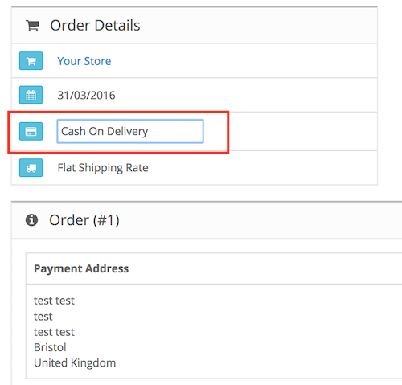

# Quick Order Update

* Current Version: 2.0.0
* Last Updated: 11 July 2017
* License: [Commercial License][1]
* Compatibility: OpenCart 1.5.1.x, 1.5.2.x, 1.5.3.x, 1.5.4.x, 1.5.5.x, 1.5.6.x, 2.x, 3.x

[1]: https://www.marketinsg.com/usage-license

## Description

Ever needed to quickly edit only a couple of fields for your orders, but do not wish to go through the long process of editing each order? Quick Order Update does just what you need!

## Features

* Quick edit order details by clicking on fields
* Following fields can be edited:
	* Email
	* Telephone
	* Payment First Name
	* Payment Last Name
	* Payment Company
	* Payment Address 1
	* Payment Address 2
	* Payment City
	* Payment Postcode
	* Payment Zone
	* Payment Country
	* Payment Method
	* Shipping First Name
	* Shipping Last Name
	* Shipping Company
	* Shipping Address 1
	* Shipping Address 2
	* Shipping City
	* Shipping Postcode
	* Shipping Zone
	* Shipping Country
	* Shipping Method

## Installation

### OpenCart Cloud

1. Purchase the extension from your administration panel.
2. Proceed to `Extensions >> Extensions` and select `Modules`. Then, install `Quick Order Update`. Configure extension accordingly.
3. Proceed to `Extensions >> Modifications` and click the blue refresh button.
4. Popup notification will now show up when a product is added.

### OpenCart 2 & 3

1. Go to `Admin >> Extensions >> Installer` to upload the extension zip file.
2. Proceed to `Extensions >> Extensions` and select `Modules`. Then, install `Quick Order Update`. Configure extension accordingly.
3. Proceed to `Extensions >> Modifications` and click the blue refresh button.
4. Popup notification will now show up when a product is added.

### OpenCart 1.5

1. Unzip the files. Ensure that vQmod has been installed.
2. Upload the files WITHIN the upload folder to your OpenCart installation folder with a FTP client. The folders should merge.
3. In your admin panel, proceed to `Extensions >> Modules`. Then, install `Quick Order Update`. Configure extension accordingly.
4. Popup notification will now show up when a product is added.

## Configurations

### OpenCart 1.5, 2, 3 & Cloud

1. Using Quick Order Update

You can click on the editable fields in the order information page to quickly update the fields. Clicking out of the field will automatically save the changes.

## Change Log

### Version 2.0.0 (11/07/2017)
* Fixed compatibility with OpenCart 3.0.0.0
* Minor improvements and updates
* Ceased support for OpenCart 1.5
### Version 1.1.0 (09/12/2016)
* Fixed compatibility with OpenCart 2.2.0.0 and above