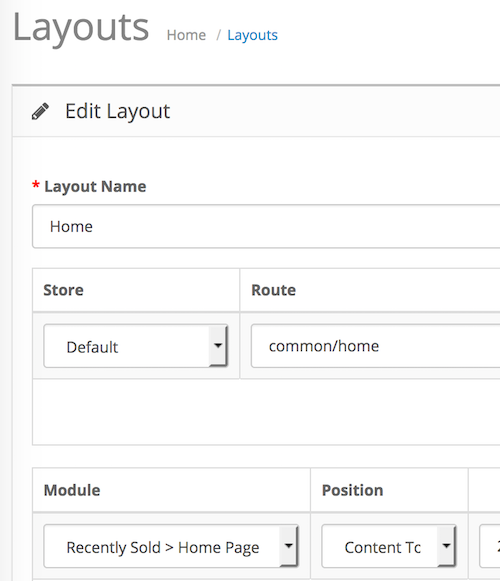

# Recently Sold

* Current Version: 2.0.0
* Last Updated: 11 July 2017
* License: [Commercial License][1]
* Compatibility: OpenCart 1.5.1.x, 1.5.2.x, 1.5.3.x, 1.5.4.x, 1.5.5.x, 1.5.6.x, 2.x, 3.x

[1]: https://www.marketinsg.com/usage-license

## Description

Recently Sold allows your customers to see the most recently sold products on your store.

If you do not have any recently sold products, the latest products will be shown instead.

## Features

* Display recently sold products to customer
* Displays latest products if there isn’t enough products to fill up the module

## Installation

### OpenCart Cloud

1. Purchase the extension from your administration panel.
2. Proceed to `Extensions >> Extensions` and select `Modules`. Then, install `Recently Sold`. Configure extension accordingly.
3. Please view configuration details below.

### OpenCart 2 & 3

1. Go to `Admin >> Extensions >> Installer` to upload the extension zip file.
2. Proceed to `Extensions >> Extensions` and select `Modules`. Then, install `Recently Sold`. Configure extension accordingly.
3. Please view configuration details below.

### OpenCart 1.5

1. Unzip the files.
2. Upload the files WITHIN the upload folder to your OpenCart installation folder with a FTP client. The folders should merge.
3. In your admin panel, proceed to `Extensions >> Modules`. Then, install `Recently Sold`. Configure extension accordingly.
4. Please view configuration details below.

## Configurations

### OpenCart 2, 3 & Cloud

1. Adding Module to Layout

	Once you have installed and enabled the extension, you can add the extension to your layout through the OpenCart's layout management page.

	

### OpenCart 1.5

1. Adding Module to Layout

	Once you have installed the extension, you can add the extension to your layout through the Recently Sold module settings page itself.

## Change Log

### Version 2.0.0 (11/07/2017)
* Fixed compatibility with OpenCart 3.0.0.0
* Fixed minor bugs and improvements
* Ceased support for OpenCart 1.5
### Version 1.0.3 (12/07/2016)
* Fixed compatibility with OpenCart 2.3.0.0
### Version 1.0.2 (07/03/2016)
* Fixed compatibility with OpenCart 2.2.0.0
### Version 1.0.1 (10/10/2015)
* Fixed minor bugs
### Version 1.0.0 (04/06/2015)
* Module created