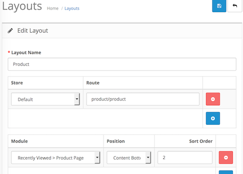

# Recently Viewed

* Current Version: 2.0.0
* Last Updated: 11 July 2017
* License: [Commercial License][1]
* Compatibility: OpenCart 1.5.1.x, 1.5.2.x, 1.5.3.x, 1.5.4.x, 1.5.5.x, 1.5.6.x, 2.x, 3.x

[1]: https://www.marketinsg.com/usage-license

## Description

Recently Viewed allows your customers to see their recently viewed products. Your customers no longer need to search their browser history when trying to find products they had just recently viewed.

If your customer has no recently viewed products, the latest products will be shown instead.

## Features

* Display recently viewed products to customer
* Remembers customer’s recently viewed product even if customer closes browser
* Displays latest products if there isn’t enough products to fill up the module

## Installation

### OpenCart Cloud

1. Purchase the extension from your administration panel.
2. Proceed to `Extensions >> Extensions` and select `Modules`. Then, install `Recently Viewed`. Configure extension accordingly.
3. Proceed to `Extensions >> Modifications` and click the blue refresh button.
4. Please view configuration details below.

### OpenCart 2 & 3

1. Go to `Admin >> Extensions >> Installer` to upload the extension zip file.
2. Proceed to `Extensions >> Extensions` and select `Modules`. Then, install `Recently Viewed`. Configure extension accordingly.
3. Proceed to `Extensions >> Modifications` and click the blue refresh button.
4. Please view configuration details below.

### OpenCart 1.5

1. Unzip the files. Ensure that vQmod has been installed.
2. Upload the files WITHIN the upload folder to your OpenCart installation folder with a FTP client. The folders should merge.
3. In your admin panel, proceed to `Extensions >> Modules`. Then, install `Recently Viewed`. Configure extension accordingly.
4. Please view configuration details below.

## Configurations

### OpenCart 2, 3 & Cloud

1. Adding Module to Layout

	Once you have installed and enabled the extension, you can add the extension to your layout through the OpenCart's layout management page.

	

### OpenCart 1.5

1. Adding Module to Layout

	Once you have installed the extension, you can add the extension to your layout through the Recently Viewed module settings page itself.

## Change Log

### Version 2.0.0 (11/07/2017)
* Fixed compatibility with OpenCart 3.0.0.0
* Fixed minor bugs and improvements
* Ceased support for OpenCart 1.5
### Version 1.0.4 (12/07/2016)
* Fixed compatibility with OpenCart 2.3.0.0
### Version 1.0.3 (07/03/2016)
* Fixed compatibility with OpenCart 2.2.0.0
### Version 1.0.2 (04/01/2016)
* Fixed minor bugs
### Version 1.0.1 (14/12/2015)
* Minor improvements
### Version 1.0.0 (04/06/2015)
* Module created