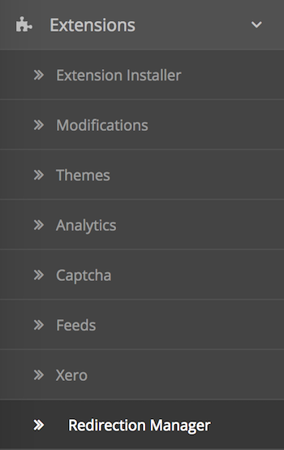

# Redirection Manager

* Current Version: 2.0.0
* Last Updated: 11 July 2017
* License: [Commercial License][1]
* Compatibility: OpenCart 1.5.1.x, 1.5.2.x, 1.5.3.x, 1.5.4.x, 1.5.5.x, 1.5.6.x, 2.x, 3.x

[1]: https://www.marketinsg.com/usage-license

## Description

Redirection Manager allows you to manage the 404 pages on your website and easily set up redirections on your website to redirect customers to different URLs.

For example, if you had recently changed the URL of one of your product, or recently removed a product, but wish to redirect your customer to a new page, you can easily enter in the URLs and the system will redirect customers accordingly.

Also, if customers are regularly hitting a 404 link on your page, you can log those pages with our Redirection Manager, and set up redirections to send them to the correct URLs on your website.

## Features

* Log 404 pages your customers are getting on your website
* Supports OpenCart multi-store feature
* Set various server response codes for redirection
* Choose the ‘From’ and ‘To’ link for redirection
* Set up wildcard matching for URLs or partial matching for URLs
* Easily add redirections for your OpenCart store from the admin panel
* Hits counter to track the number of times the ‘from’ URL is reached by your customers
* Exclude certain URLs based on keywords from being logged

## Installation

### OpenCart Cloud

1. Purchase the extension from your administration panel.
2. In your admin panel, proceed to `User >> User`. Give yourself permission to access and modify the Redirection Manager page.
3. Proceed to Extensions >> Modifications and click the blue refresh button.
4. Please view configuration details below.

### OpenCart 3

1. Go to `Admin >> Extensions >> Installer` to upload the extension zip file.
2. In your admin panel, proceed to `User >> User`. Give yourself permission to access and modify the Redirection Manager page.
3. Proceed to Extensions >> Modifications and click the blue refresh button.
4. Please view configuration details below.

### OpenCart 1.5 & 2

1. Unzip the files. Ensure that vQmod has been installed.
2. Upload the files WITHIN the upload folder to your OpenCart installation folder with a FTP client. The folders should merge.
3. In your admin panel, proceed to `User >> User`. Give yourself permission to access and modify the Redirection Manager page.
4. View your admin dashboard page for the installation to be completed.
5. Please view configuration details below.

## Configurations

### OpenCart 1.5, 2, 3 & Cloud

1. Accessing Redirection Manager

	Redirection manager can be accessed via your administration panel `Extensions >> Redirection Manager`.

	

2. Redirect From Setup

	You can setup the system to detect using wildcard URLs. All you need to do is to make use of either `%` or `_`. `%` will match 0 or more characters, while `_` will match any single characters.

	For example, `%www.example.com` will match `https://www.example.com`, `http://www.example.com`, and `anythingwww.example.com`. `www.exam_le.com` will match `www.example.com`, `www.examOle.com`, and `www.examXle.com`.

## Change Log

### Version 2.0.0 (11/07/2017)
* Fixed compatibility with OpenCart 3.0.0.0
* Minor improvements and updates
* Ceased support for OpenCart 1.5
### Version 1.2.5 (06/11/2016)
* Fixed minor bugs for OpenCart 1.5 release
### Version 1.2.4 (13/07/2016)
* Fixed compatibility with OpenCart 2.3.0.0
### Version 1.2.3 (01/04/2016)
* Fixed compatibility with OpenCart 2.2.0.0
### Version 1.2.2 (27/03/2016)
* Fixed missing exclude values being shown after saving
### Version 1.2.1 (07/03/2016)
* Fixed compatibility with OpenCart 2.2.0.0
### Version 1.2.0 (13/12/2015)
* Added feature to exclude logging by keywords
### Version 1.1.1 (24/05/2015)
* Fixed extension not saving settings
### Version 1.1.0 (19/05/2015)
* Minor admin aesthetic improvements
### Version 1.0.1 (23/04/2015)
* OC 2.0.2.0 mail support compatibility fix
### Version 1.0.0 (14/01/2015)
* Module created.