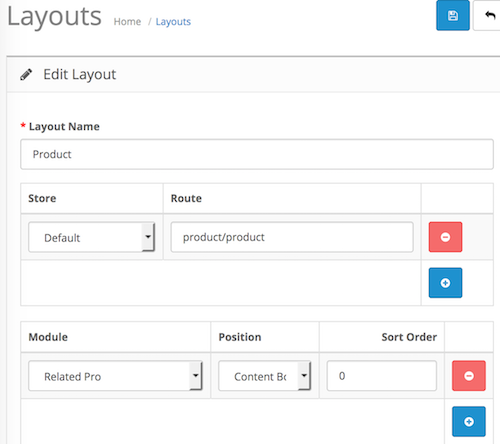

# Related Pro

* Current Version: 3.0.0
* Last Updated: 11 July 2017
* License: [Commercial License][1]
* Compatibility: OpenCart 1.5.1.x, 1.5.2.x, 1.5.3.x, 1.5.4.x, 1.5.5.x, 1.5.6.x, 2.x, 3.x

[1]: https://www.marketinsg.com/usage-license

## Description

Related Pro allows you to customise your related products easily. It allows the system to fetch similarly named products, products in the same categories, and even products you had manually set as related products as the related products at the product’s page. Randomise your related products, limit them, or even remove the default OpenCart’s related products section easily with this module.

## Features

* Fetch related products from similar named products
* Fetch related products from similar category
* Randomise related products
* Remove OpenCart’s related products section (configurable)
* Limit related products
* Add related products module to product page
* Display module in tab (OpenCart 2, 3 & Cloud)

## Installation

### OpenCart Cloud

1. Purchase the extension from your administration panel.
2. Proceed to `Extensions >> Extensions` and select `Modules`. Then, install `Related Pro`. Configure extension accordingly.
3. Proceed to `Extensions >> Modifications` and click the blue refresh button.
4. Please view configuration details below.

### OpenCart 3

1. Go to `Admin >> Extensions >> Installer` to upload the extension zip file.
2. Proceed to `Extensions >> Extensions` and select `Modules`. Then, install `Related Pro`. Configure extension accordingly.
3. Proceed to `Extensions >> Modifications` and click the blue refresh button.
4. Please view configuration details below.

### OpenCart 1.5 & 2

1. Unzip the files. Ensure that vQmod has been installed.
2. Upload the files WITHIN the upload folder to your OpenCart installation folder with a FTP client. The folders should merge.
3. In your admin panel, proceed to `Extensions >> Modules`. Then, install `Related Pro`. Configure extension accordingly.
4. Please view configuration details below.

## Configurations

### OpenCart 2, 3 & Cloud

1. Adding Module to Layout

	Once you have installed and enabled the extension, you can add the extension to your __product page__ layout through the OpenCart's layout management page.

	

### OpenCart 1.5

1. Adding Module to Layout

	Once you have installed the extension, you can add the extension to your __product page__ layout through the Related Pro module settings page itself.

## Change Log

### Version 3.0.0 (11/07/2017)
* Fixed compatibility with OpenCart 3.0.0.0
* Fixed minor bugs and improvements
* Ceased support for OpenCart 1.5
### Version 2.2.3 (12/07/2016)
* Fixed compatibility with OpenCart 2.3.0.0
### Version 2.2.2 (07/03/2016)
* Fixed compatibility with OpenCart 2.2.0.0
### Version 2.2.1 (19/06/2015)
* Critical bug fix for OC 2 wrong require_once file
### Version 2.2.0 (17/06/2015)
* Minor admin aesthetic improvements
### Version 2.1.4 (23/04/2015)
* OC 2.0.2.0 mail support compatibility fix
### Version 2.1.3 (26/03/2015)
* Minor bug fix for products with no category
### Version 2.1.2 (03/02/2015)
* Bug fixes for ‘AND’ condition
### Version 2.1.1 (23/12/2014)
* Update support Facebook link
### Version 2.1.0 (20/10/2014)
* OC 2 compatibility
### Version 2.0.0 (02/09/2014)
* Better character escaping
* Conditions joining
* Words exclusion
* Better search matching
### Version 1.0.1 (24/05/2014)
* Minor bug fixes
### Version 1.0 (16/05/2014)
* Module created.