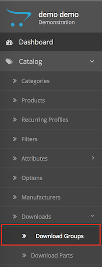
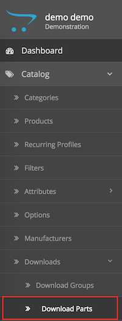
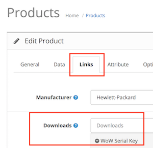
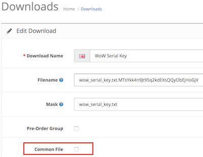
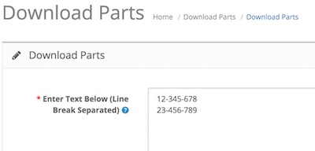
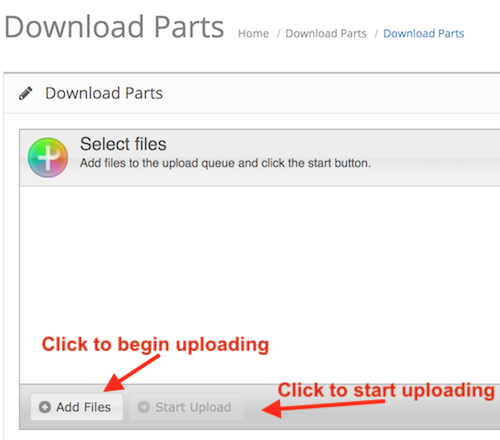

# Serial Key Extension

* Current Version: 5.0.0
* Last Updated: 12 July 2017
* License: [Commercial License][1]
* Compatibility: OpenCart 1.5.1.x, 1.5.2.x, 1.5.3.x, 1.5.4.x, 1.5.5.x, 1.5.6.x, 2.x, 3.x

[1]: https://www.marketinsg.com/usage-license

## Description

Serial Key extension allows you to sell serial keys or any other downloadable products to your customers. This extension will ensure each customer gets their unique download files. Best use for serial keys download, accounts selling, or any other stores that needs to give each customer a unique download file different from each other.

## Features

* Low downloads (serial keys) email notification
* Out of downloads (serial keys) email notification
* Email notification if customer had purchased and there isn’t any unique download (serial key) available for him at the moment.
* Multiple uploads supported
* Drag and drop upload supported 
* Mass keys upload available using textarea function
* Files uploaded are encrypted for security
* Configure which order status to release the download to customers
* Configure which order status to revoke download from customers
* Can be used with any themes
* Unlimited downloads (serial keys) can be added to each product
* Ensure each download is unique to each customer
* Image, txt, pdf, zip file upload supported
* Optional function to attach downloads (serial keys) to order confirmation email
* Optional function to return keys back to unused state for deleted orders
* Optional function to assign product options with a download group
* Pre order function
* Common file function to allow upload of shared common file

## Installation

### OpenCart Cloud

1. Purchase the extension from your administration panel.
2. Proceed to `Extensions >> Extensions` and select `Modules`. Then, install `Downloads (Serial Key)`. Configure extension accordingly.
3. Please view configuration details below.

### OpenCart 3

1. Go to `Admin >> Extensions >> Installer` to upload the extension zip file.
2. Proceed to `Extensions >> Extensions` and select `Modules`. Then, install `Downloads (Serial Key)`. Configure extension accordingly.
3. Please view configuration details below.

### OpenCart 1.5 & 2

1. Unzip the files.
2. Upload the files WITHIN the upload folder to your OpenCart installation folder with a FTP client. The folders should merge.
3. In your admin panel, proceed to `Extensions >> Modules`. Then, install `Downloads (Serial Key)`. Configure extension accordingly.
4. Please view configuration details below.

## Configurations

### OpenCart 1.5, 2, 3 & Cloud

1. Basic Configurations

	Configure the extension settings in the extension's page. Basic configurations such as the download parts release status, and the email notification settings can be done here.

2. Creating Download Groups

	Create a pool for your serial keys to be placed into. You can do so from the menu `Catalog >> Downloads >> Download Groups`.

	

3. Adding Keys to Group

	Add serial keys to the newly created download groups. You can do so from the menu `Catalog >> Downloads >> Download Parts`.

	

4. Linking Download Group to Product

	Link your download group to a product. You can do so in `Catalog >> Products >> Edit Product >> Links` tab. Once the download group has been linked to the product, any customer that purchases this product will receive a single download part from the linked group. The system will look into the assigned download group, and issue an unused download part to the customer.

	

5. Common File Feature

	If you wish to issue a common file to all customers (i.e. the same file for all customers), you can select the "Common File" option. Customers that purchases a product with the common file option enabled will get the download file that was uploaded into the download group.

	

6. Pre-Order Feature

	If you are selling a pre-order product, and does not want the out of stock notification email to be sent, you can enable the option "Pre-Order Group" in the download group page.

7. Orders with Unassigned Download Parts

	You can find a the list of orders with unassigned download parts in `Sales >> Orders >> Downloads`. Orders are showing up here because you ran out of unused keys in the group. You will need to add more keys to the download group before you update the order status of the order using the Add Order History feature in OpenCart.

8. Text Area Upload

	The text area upload function gives you the ability to mass upload serial keys if they are stored in an Excel or CSV file. All you need to do is to enter a key each line, and the system will add it into the download group for you.

	

9. File Uploader

	You can mass upload files using the file uploader available.

	

## Change Log

### Version 5.0.0 (12/07/2017)
* Fixed compatibility with OpenCart 3.0.0.0
* Fixed minor bugs and improvements
* Ceased support for OpenCart 1.5
### Version 4.1.4 (11/01/2017)
* Fixed OC 2.3 file upload issue
* Fixed data that are not validated before sending across 
### Version 4.1.3 (26/09/2016)
* Fixed missing update button for OpenCart 2 release
### Version 4.1.2 (12/07/2016)
* Fixed compatibility with OpenCart 2.3.0.0
### Version 4.1.1 (07/04/2016)
* Fixed compatibility with OpenCart 2.2.0.0
### Version 4.1.0 (08/03/2016)
* Minor admin aesthetic improvements
### Version 3.4.0 (14/05/2015)
* Minor admin aesthetic improvements
### Version 4.0.3 (22/04/2015)
* Minor bug fixes for out of stock download page(OC 2)
### Version 4.0.2 (21/01/2015)
* Bug fixes (OC 2)
### Version 4.0.1 (23/12/2014)
* Update support Facebook link
* Minor bug fixes
### Version 4.0.0 (24/10/2014)
* OC 2 compatibility
* Common file feature to share common files
* Updated uploader
### Version 3.3.0 (24/10/2014)
* Preorder status
### Version 3.2.2 (20/08/2014)
* Bug fixes
### Version 3.2.1 (27/06/2014)
* Bug fixes
### Version 3.2.0 (23/02/2014)
* Preorder function
* Turn off email notification
* Download keys folder moved
* Bug fixes
### Version 3.1.0 (29/09/2013)
* Allow options to be able to be assigned with download group
* Update admin upload script
### Version 3.0.0 (11/08/2013)
* Attachments in order status update email
* Cancel return key back to unused state
* Uploader ### Version update
* Chunking to support large files upload
* Bug fixes
### Version 2.3.0 (31/05/2013)
* Attachments in order confirmation email
* Deleted orders returns key back to unused state
* Minor fixes
* Built in support system
### Version 2.2.0 (22/04/2013)
* Able to download back the files you uploaded
* Images size fixed
### Version 2.1.0 (17/04/2013)
* Improved encryption
### Version 2.0.0 (15/04/2013)
* Major improvements
* Security enhancements
* New textarea feature
* Encryption for uploaded files
* Allow control of status to release download
* Bug fixes
### Version 1.2.0 (17/01/2013)
* Quantity bug fix
### Version 1.1.0 (09/01/2013)
* OpenCart v1.5.5 compatibility