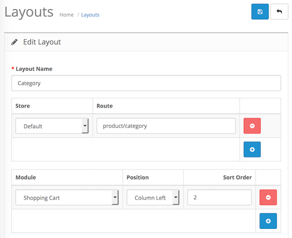

# Shopping Cart

* Current Version: 4.0.0
* Last Updated: 13 July 2017
* License: [Commercial License][1]
* Compatibility: OpenCart 1.5.1.x, 1.5.2.x, 1.5.3.x, 1.5.4.x, 1.5.5.x, 1.5.6.x, 2.x, 3.x

[1]: https://www.marketinsg.com/usage-license

## Description

Shopping Cart is a simple module to display the customer’s shopping cart anywhere on your website. You can place it at left, right, top, or even bottom of the page’s layout in your OpenCart store. It also comes with animation when you add an item to cart.

## Features

* Auto update cart when an item is added
* Animation when an item is added
* Animation available even if cart is not displayed
* Simple styling to match your theme
* Small cross beside each item for quick removal from cart

## Installation

### OpenCart Cloud

1. Purchase the extension from your administration panel.
2. Proceed to `Extensions >> Extensions` and select `Modules`. Then, install `Shopping Cart`. Configure extension accordingly.
3. Proceed to `Extensions >> Modifications` and click the blue refresh button.
4. Go to the layouts management page in your admin and add this module to the layout you wish to display on. 

### OpenCart 3

1. Go to `Admin >> Extensions >> Installer` to upload the extension zip file.
2. Proceed to `Extensions >> Extensions` and select `Modules`. Then, install `Shopping Cart`. Configure extension accordingly.
3. Proceed to `Extensions >> Modifications` and click the blue refresh button.
4. Go to the layouts management page in your admin and add this module to the layout you wish to display on.

### OpenCart 2

1. Unzip the files. Ensure that vQmod has been installed.
2. Upload the files WITHIN the upload folder to your OpenCart installation folder with a FTP client. The folders should merge.
3. In your admin panel, proceed to `Extensions >> Modules`. Then, install `Shopping Cart`. Configure extension accordingly.
4. Go to the layouts management page in your admin and add this module to the layout you wish to display on. 

### OpenCart 1.5

1. Unzip the files. Ensure that vQmod has been installed.
2. Upload the files WITHIN the upload folder to your OpenCart installation folder with a FTP client. The folders should merge.
3. In your admin panel, proceed to `Extensions >> Modules`. Then, install `Shopping Cart`. Configure extension accordingly.
4. Add this module to the layout you wish to display on right from the module settings page.

## Configurations

### OpenCart 2, 3 & Cloud

1. Adding Module to Layout

	Once you have installed and enabled the extension, you can add the extension to your layout through the OpenCart's layout management page.

	

### OpenCart 1.5

1. Adding Module to Layout

	Once you have installed the extension, you can add the extension to your layout through the Shopping Cart module settings page itself.

## Change Log

### Version 4.0.0 (13/07/2017)
* Fixed compatibility with OpenCart 3.0.0.0
* Fixed minor bugs and improvements
* Ceased support for OpenCart 1.5
### Version 3.3.5 (26/09/2016)
* Fixed minor bugs
* Added minor improvements
### Version 3.3.4 (12/07/2016)
* Fixed compatibility with OpenCart 2.3.0.0
### Version 3.3.3 (08/03/2016)
* Fixed compatibility with OpenCart 2.2.0.0
### Version 3.3.2 (24/02/2016)
* Fixed compatibility issues with OC 2.1.0.0
### Version 3.3.1 (20/05/2015)
* Fixed minor permission issues
### Version 3.3.0 (14/05/2015)
* Minor admin aesthetic improvements
### Version 3.2.4 (23/04/2015)
* OC 2.0.2.0 mail support compatibility fix
### Version 3.2.3 (02/04/2015)
* OC 2.0.2.0 compatibility
### Version 3.2.2 (28/01/2015)
* OC 2 version bug fixes
### Version 3.2.1 (23/12/2014)
* Updated support Facebook link
### Version 3.2.0 (10/10/2014)
* Added OpenCart 2.0 compatibility
### Version 3.1.0(25/06/2013)
* Bug fixes for v1.5.2.1 to v1.5.5.1
### Version 3.0.0 (07/05/2013)
* Animation now on all pages
* Merged for all different versions of OpenCart
* Support desk in admin panel