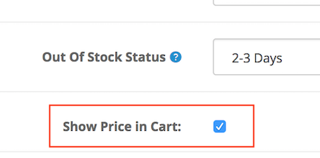

# Show Price in Cart

* Current Version: 2.0.0
* Last Updated: 13 July 2017
* License: [Commercial License][1]
* Compatibility: OpenCart 1.5.1.x, 1.5.2.x, 1.5.3.x, 1.5.4.x, 1.5.5.x, 1.5.6.x, 2.x, 3.x

[1]: https://www.marketinsg.com/usage-license

## Description

Show Price in Cart allows you to hide your product prices from the public, and only showing the price when the product has been added to the shopping cart. This will prevent your competitors from easily browsing and comparing prices with your store, and also prevent casual shoppers from comparing prices between multiple shops.

## Features

* Hide prices from listing
* Only display product price when item is added into shopping cart
* Hide prices only for selected products

## Installation

### OpenCart Cloud

1. Purchase the extension from your administration panel.
2. Proceed to `Extensions >> Extensions` and select `Modules`. Then, install `Show Price in Cart`. Configure extension accordingly.
3. Proceed to `Extensions >> Modifications` and click the blue refresh button.
4. Please view configuration details below.

### OpenCart 3

1. Go to `Admin >> Extensions >> Installer` to upload the extension zip file.
2. Proceed to `Extensions >> Extensions` and select `Modules`. Then, install `Show Price in Cart`. Configure extension accordingly.
3. Proceed to `Extensions >> Modifications` and click the blue refresh button.
4. Please view configuration details below.

### OpenCart 1.5 & 2

1. Unzip the files. Ensure that vQmod has been installed.
2. Upload the files WITHIN the upload folder to your OpenCart installation folder with a FTP client. The folders should merge.
3. In your admin panel, proceed to `Extensions >> Modules`. Then, install `Show Price in Cart`. Configure extension accordingly.
4. Please view configuration details below.

## Configurations

### OpenCart 1.5, 2, 3 & Cloud

1. Configuring Show Price in Cart

	Show price in cart can be enabled only for specific products. You can do so in `Catalog >> Products >> Edit Product >> Data` tab. Selecting the option will enable the feature for the specific product.

	

## Change Log

### Version 2.0.0 (13/07/2017)
* Fixed compatibility with OpenCart 3.0.0.0
* Minor improvements and updates
* Ceased support for OpenCart 1.5
### Version 1.0.2 (12/07/2016)
* Fixed compatibility with OpenCart 2.3.0.0
### Version 1.0.1 (08/03/2016)
* Fixed compatibility with OpenCart 2.2.0.0
### Version 1.0.0 (25/06/2015)
* Extension created