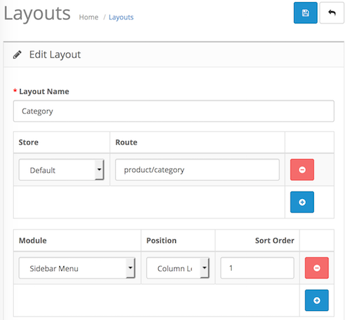

# Sidebar Menu

* Current Version: 3.0.0
* Last Updated: 13 July 2017
* License: [Commercial License][1]
* Compatibility: OpenCart 1.5.1.x, 1.5.2.x, 1.5.3.x, 1.5.4.x, 1.5.5.x, 1.5.6.x, 2.x, 3.x

[1]: https://www.marketinsg.com/usage-license

## Description

Sidebar Menu is similar to the default 'Category' Module. It allows you to have a drop down menu instead of the default listing for the sub-categories. Sidebar Menu comes with a standalone CCS file, which allows you to easily customise it to match your theme's design!

## Features

* Multi layers menu
* Supports up to 4 layers
* Customisable CSS to match your theme
* 100% CSS, works even in JavaScript disabled browser

## Installation

### OpenCart Cloud

1. Purchase the extension from your administration panel.
2. Proceed to `Extensions >> Extensions` and select `Modules`. Then, install `Sidebar Menu`. Configure extension accordingly.
3. Please view configuration details below.

### OpenCart 2 & 3

1. Go to `Admin >> Extensions >> Installer` to upload the extension zip file.
2. Proceed to `Extensions >> Extensions` and select `Modules`. Then, install `Sidebar Menu`. Configure extension accordingly.
3. Please view configuration details below.

### OpenCart 1.5

1. Unzip the files.
2. Upload the files WITHIN the upload folder to your OpenCart installation folder with a FTP client. The folders should merge.
3. In your admin panel, proceed to `Extensions >> Modules`. Then, install `Sidebar Menu`. Configure extension accordingly.
4. Please view configuration details below.

## Configurations

### OpenCart 2, 3 & Cloud

1. Adding Module to Layout

	Once you have installed and enabled the extension, you can add the extension to your layout through the OpenCart's layout management page.

	

### OpenCart 1.5

1. Adding Module to Layout

	Once you have installed the extension, you can add the extension to your layout through the Sidebar Menu module settings page itself.

## Change Log

### Version 3.0.0 (13/07/2017)
* Fixed compatibility with OpenCart 3.0.0.0
* Fixed minor bugs and improvements
* Ceased support for OpenCart 1.5
### Version 2.3.2 (12/07/2016)
* Fixed compatibility with OpenCart 2.3.0.0
### Version 2.3.1 (01/04/2016)
* Fixed minor bug
### Version 2.3.0 (10/03/2016)
* Fixed compatibility with OpenCart 2.2.0.0
### Version 2.2.2 (23/04/2015)
* OC 2.0.2.0 mail support compatibility fix
### Version 2.2.1 (23/12/2014)
* Update support Facebook link
### Version 2.2.0 (20/10/2014)
* Fixed compatibility with OpenCart 2.0.0.0