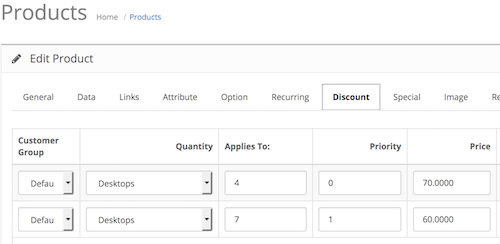

# Tiered Pricing

* Current Version: 2.0.0
* Last Updated: 13 July 2017
* License: [Commercial License][1]
* Compatibility: OpenCart 1.5.1.x, 1.5.2.x, 1.5.3.x, 1.5.4.x, 1.5.5.x, 1.5.6.x, 2.x, 3.x

[1]: https://www.marketinsg.com/usage-license

## Description

Set tiered pricing for your products based on categories or across the website.

For example, you can setup discounts as per follow:

* Purchase X or more items from Category Y at $Z
* Purchase X or more items from ANY categories at $Z
* Purchase X or more of Product Y at $Z

## Features

* Allow tiered pricing for products
* Allow OpenCart discounts to work across categories
* Set category limitation for OpenCart discounts from admin panel

## Installation

### OpenCart Cloud

1. Purchase the extension from your administration panel.
2. Proceed to `Extensions >> Extensions` and select `Modules`. Then, install `Tiered Pricing`. Configure extension accordingly.
3. Proceed to `Extensions >> Modifications` and click the blue refresh button.
4. Please view configuration details below.

### OpenCart 3

1. Go to `Admin >> Extensions >> Installer` to upload the extension zip file.
2. Proceed to `Extensions >> Extensions` and select `Modules`. Then, install `Tiered Pricing`. Configure extension accordingly.
3. Proceed to `Extensions >> Modifications` and click the blue refresh button.
4. Please view configuration details below.

### OpenCart 1.5 & 2

1. Unzip the files. Ensure that vQmod has been installed.
2. Upload the files WITHIN the upload folder to your OpenCart installation folder with a FTP client. The folders should merge.
3. In your admin panel, proceed to `Extensions >> Modules`. Then, install `Tiered Pricing`. Configure extension accordingly.
4. Please view configuration details below.

## Configurations

### OpenCart 1.5, 2, 3 & Cloud

1. Configuring Discounts

	Setup discounts for tiered pricing to show up. You can do so in `Catalog >> Products >> Edit Product >> Discount` tab.

	

## Change Log

### Version 2.0.0 (13/07/2017)
* Fixed compatibility with OpenCart 3.0.0.0
* Minor improvements and updates
* Ceased support for OpenCart 1.5
### Version 1.1.5 (27/02/2017)
* Fixed minor bugs with price being replaced (OC 2 Release)
### Version 1.1.4 (13/07/2016)
* Fixed compatibility with OpenCart 2.3.0.0
### Version 1.1.3 (01/04/2016)
* Fixed compatibility with OpenCart 2.2.0.0
### Version 1.1.2 (08/03/2016)
* Fixed compatibility with OpenCart 2.2.0.0
### Version 1.1.1 (02/03/2016)
* Fixed incomplete compatibility fix in previous release
### Version 1.1.0 (01/03/2016)
* Improved installation method
* Fixed compatibility issue with OC 2.1.x
### Version 1.0.1 (10/03/2015)
* Bug fix for OC 2 release