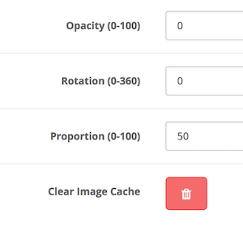

# Watermark

* Current Version: 2.0.1
* Last Updated: 15 May 2018
* License: [Commercial License][1]
* Compatibility: OpenCart 1.5.1.x, 1.5.2.x, 1.5.3.x, 1.5.4.x, 1.5.5.x, 1.5.6.x, 2.x, 3.x

[1]: https://www.marketinsg.com/usage-license

## Description

Add watermark to your images easily with our Watermark extension. No complicated configurations, no complicated setup. Just upload, and choose your watermark logo and you are good to go.

## Features

* Add watermark to images on OpenCart store
* Able to select the position of the watermark
* Able to select which images should have the watermark
* Able to adjust the proportion of the watermark to the image size
* Able to adjust watermark rotation angle
* Simple configurations, easy to use

## Installation

### OpenCart Cloud

1. Purchase the extension from your administration panel.
2. Proceed to `Extensions >> Extensions` and select `Modules`. Then, install `Watermark`. Configure extension accordingly.
3. Proceed to `Extensions >> Modifications` and click the blue refresh button.
4. Please view configuration details below.

### OpenCart 3

1. Go to `Admin >> Extensions >> Installer` to upload the extension zip file.
2. Proceed to `Extensions >> Extensions` and select `Modules`. Then, install `Watermark`. Configure extension accordingly.
3. Proceed to `Extensions >> Modifications` and click the blue refresh button.
4. Please view configuration details below.

### OpenCart 1.5 & 2

1. Unzip the files. Ensure that vQmod has been installed.
2. Upload the files WITHIN the upload folder to your OpenCart installation folder with a FTP client. The folders should merge.
3. In your admin panel, proceed to `Extensions >> Modules`. Then, install `Watermark`. Configure extension accordingly.
4. Please view configuration details below.

## Configurations

### OpenCart 1.5, 2, 3 & Cloud

1. Setting Up Watermark Image

	Please ensure you have selected a PNG image to be used as the watermark. Only PNG image is selected.

2. Clearing Image Cache

	You will have to clear your image cache before any changes are reflected.

	

## Change Log

### Version 2.0.1 (15/05/2018)
* Fixed watermark not generated when cache image is of the same size
### Version 2.0.0 (14/07/2017)
* Fixed compatibility with OpenCart 3.0.0.0
* Minor improvements and updates
* Ceased support for OpenCart 1.5
### Version 1.1.2 (13/07/2016)
* Fixed compatibility with OpenCart 2.3.0.0
### Version 1.1.1 (20/04/2016)
* Fixed transparency when opacity is used without rotation
### Version 1.1.0 (15/04/2016)
* Added watermark rotation angle
* Fixed transparency when opacity is used
### Version 1.0.0 (13/04/2016)
* Module created.