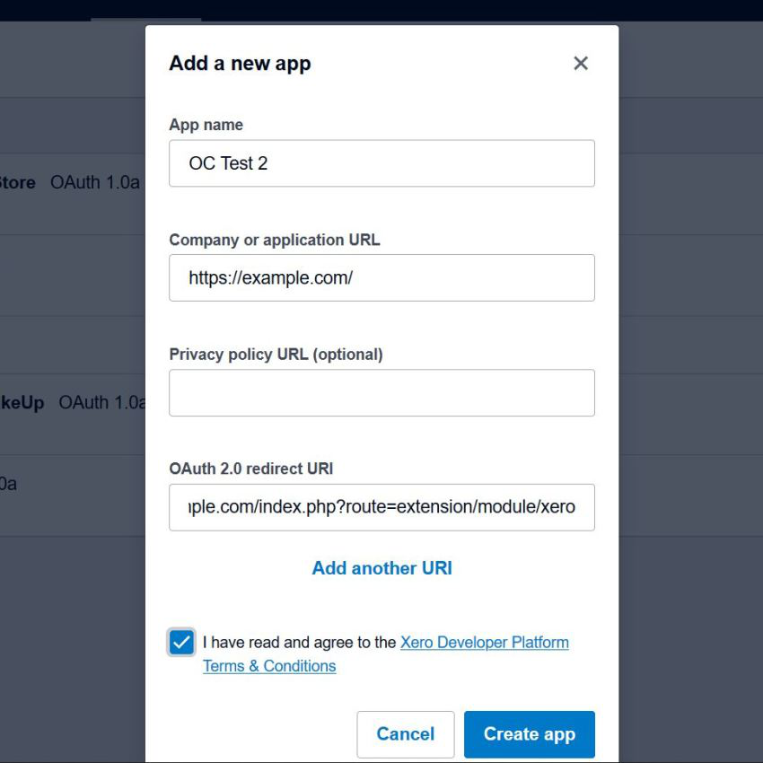

# Xero Integration

* Current Version: 4.1.0
* Last Updated: 05 November 2017
* License: [Commercial License][1]
* Compatibility: OpenCart 1.5.1.x, 1.5.2.x, 1.5.3.x, 1.5.4.x, 1.5.5.x, 1.5.6.x, 2.x, 3.x

[1]: https://www.marketinsg.com/usage-license

## Description

Xero Integration allows you to export your OpenCart orders, customers and products to your Xero account. Automate your business accounting with our OpenCart to Xero Integration.

## Features

* Export your OpenCart customers to your Xero contacts
* Export your OpenCart orders to your Xero invoices
* Export your OpenCart products to your Xero inventory (Option values not exported)
* Automated export with cron job
* Choose order statuses to export
* Choose order statuses to remove from Xero
* Supports multi store – Export orders to different sales account in Xero based on the store the order belongs to
* Supports a different account code for your freight / courier charges
* Supports payment account code and tax rounding account code
* Sync your OpenCart product stocks with your Xero inventory (Option values quantity not sync)

## Installation

### OpenCart Cloud

1. Purchase the extension from your administration panel.
2. Proceed to `Users >> User Groups` and select give permission to view and modify `extension/xero`.
3. Proceed to `Extensions >> Modifications` and click the blue refresh button.
4. Configure extension accordingly in `Extensions >> Xero`.

### OpenCart 3

1. Go to `Admin >> Extensions >> Installer` to upload the extension zip file.
2. Proceed to `Users >> User Groups` and select give permission to view and modify `extension/xero`.
3. Proceed to `Extensions >> Modifications` and click the blue refresh button.
4. Configure extension accordingly in `Extensions >> Xero`.

### OpenCart 1.5 & 2

1. Unzip the files. Ensure that vQmod has been installed.
2. Upload the files WITHIN the upload folder to your OpenCart installation folder with a FTP client. The folders should merge.
3. Proceed to `Users >> User Groups` and select give permission to view and modify `extension/xero`.
4. Configure extension accordingly in `Extensions >> Xero`.

## Configurations

### OpenCart 1.5, 2, 3 & Cloud

1. Sign Up with Xero

	If you do not have an account with Xero, please sign up at https://www.xero.com before proceeding.

2. Getting your Key & Secret

	Generate a new certificate (see point 5 below) or use the certificate included in the zip package of our software. Proceed to https://app.xero.com/Application/ to setup your application.

	1. Add an application.
	2. Select "Private Application".
	3. Enter an Application Name (e.g. OpenCart Integration).
	4. Select an organisation for application to access.
	5. Upload the certificate file (file is located in our zip folder (`system/library/xero/certs/xero_public.cer`).
	6. Agree to Xero's terms and conditions.
	7. Save the application.
	8. You will now be presented with the consumer key and consumer secret.

	

3. Setup Cron Job

	Setup a cron job task to automate the export. The cron job command is provided in your admin dashboard. Please copy it and setup your cron job task accordingly in your cPanel.

4. Xero Integration Configurations

	__API Consumer Key__

	The API Consumer Key is available from your Xero application. This is a required field for authentication.

	__API Secret Key__

	The API Secret Key is available from your Xero application. This is a required field for authentication.

	__HTTP Loopback Workaround__

	This is a workaround for web hosts that have HTTP loopback prevention. Do not enable this unless your orders are not exporting and you have confirmed that loopback prevention is enabled on your server.

	__Token__

	This will be the token the system cron job uses. This is to prevent unauthorised running of the Xero Integration extension. Alphanumeric can be used. The box below will be the cron job command to use for your cron job. Best recommended to run Xero Integration cron command hourly.

	__Sales Account Code__

	Usually this is 200. Please check your Chart of Accounts to confirm. This is the sales account code. If you have more accounts in your Xero account for your multi store setup, you can assign each multi store a different account code. You can find all the account codes you require in your Chart of Accounts as per screenshot below.

	

	__Shipping Account Code__

	Usually this is 425. Please check your Chart of Accounts to confirm. This is the shipping / freight account code. If you have more accounts in your Xero account for your multi store setup, you can assign each multi store a different account code.

	__Payment Account Code__

	Please check your Chart of Accounts to confirm the account code. This is the bank / payment account code. If you have more accounts in your Xero account for your multi store setup, you can assign each multi store a different account code.

	__Rounding Account Code__

	Usually this is 860. Please check your Chart of Accounts to confirm. This is the rounding account code for tax differences. If you have more accounts in your Xero account for your multi store setup, you can assign each multi store a different account code. A new rounding line will appear, if required, as per screenshot below.

	

	__Inventory Account Code__

	Usually this is 630. Please check your Chart of Accounts to confirm. This is the inventory account code for tracked inventory.

	__Cost of Goods Sold Account Code__

	Usually this is 310. Please check your Chart of Accounts to confirm. This is the Cost of Goods Sold account code.

	__Default Invoice Status__

	The default status of the invoice when it is sent over to Xero. It can only be authorised or draft.

	__Order Statuses to Export__

	This will be the order status the orders are required to reach before they are sent over to Xero. This will be good to reduce pending payments on your Xero account.

	__Order Statuses to Remove__

	This will be the order status the orders are required to reach before they are removed from Xero. Do note that AUTHORISED invoices will be voided, and DRAFT invoices will be deleted. If orders are already marked to other statuses on Xero, Xero does not allow us to update it.

	__Sync Products to Xero Inventory__

	Xero has their own inventory. If you wish to sync your products quantities with Xero, you can turn on this function. We will then attempt to sync the stock quantities from Xero and update your product quantities on OpenCart. Model code is used for keeping Xero inventory and OpenCart products in sync.

	__Mark All Orders__

	Mark all orders as exported and our system will ignore all the orders previously made in your store. This is useful for larger stores that just installed our Xero Integration but does not wish to export old orders.

	__Unmark All Orders__

	Mark all orders as not exported and our system will attempt to export all unmarked orders again.

	__Debug__

	Enable this to write debugging logs to your OpenCart error logs. This is useful to determine the issue if your orders are not being exported.

	__Debug Order__

	This is useful to debug specific order ID that's having issues being exported. Debug needs to be enabled before this feature will work.

5. Generating Your Certificate (optional)

	If you wish to generate your own certificate, please follow the instructions below.

	__Windows__

	1. Download and extract the zip file ([https://www.dropbox.com/sh/r70yevrfgqh6tjm/FFzIj2YhYj][2]) to your C drive so the path directioy is now C:\openssl\.
	2. Search for `cmd` on your system and right click >> run as administrator.
	3. Change directory to the folder C:\openssl\bin\ with the following command:
		cd C:\openssl\bin
	4. Run the following commands to generate a certificate. A couple of questions would be asked. Answer them as accurately as possible.
		
		> set OPENSSL_CONF=c:\openssl\bin\openssl.cfg

		> openssl genrsa -out xero_private.pem 1024

		> openssl req -newkey rsa:1024 -x509 -key xero_private.pem -out xero_public.cer -days 1095

	5. You should now find the certificate in your C:\openssl\bin\ folder. The 2 files xero_private.pem and xero_public.cer will be what you need.
	6. Upload the 2 generated files to system/library/xero/certs/.

	__Linux and OS X__

	1. Open `terminal` and navigate to a directory you wish to generate the certificates in.
	2. Run the following commands to generate a certificate. A couple of questions would be asked. Answer them as accurately as possible.

		> openssl genrsa -out xero_private.pem 1024
		
		> openssl req -newkey rsa:1024 -x509 -key xero_private.pem -out xero_public.cer

	3. You should now find the certificate in the directory you have generated in. The 2 files xero_private.pem and xero_public.cer will be what you need.
	4. Upload the 2 generated files to system/library/xero/certs/.

[2]: https://www.dropbox.com/sh/r70yevrfgqh6tjm/FFzIj2YhYj

## Change Log

### Version 4.1.0 (05/11/2017)
* Added rounding account to handle taxing rounding difference
* Added debug orders feature to handle order debugging
* Improved inventory export to handle large inventories
### Version 4.0.3 (29/08/2017)
* Fixed export repeating for OpenCart 3 release
* Fixed payment code to be used instead of ID
### Version 4.0.2 (23/07/2017)
* Fixed incorrect order export for OpenCart 2 release
### Version 4.0.1 (22/07/2017)
* Fixed incorrect mark orders link for OpenCart 2 release
### Version 4.0.0 (07/07/2017)
* Fixed compatibility with OpenCart 3.0.0.0
* Added payments for invoices
* Added ability to mark selected order IDs exported
* Ceased support for OpenCart 1.5
### Version 3.2.1 (13/07/2016)
* Fixed compatibility with OpenCart 2.3.0.0
### Version 3.2.0 (09/02/2016)
* Fixed OC 2 minor search not found
* Added HTTP Loopback workaround
* Fixed minor bugs
### Version 3.1.3 (29/12/2015)
* Fixed fatal bug in Xero admin customer export
### Version 3.1.2 (21/12/2015)
* Fixed customers looping only first 50
* Fixed products looping only first 50
### Version 3.1.1 (16/12/2015)
* Fixed fatal bug preventing export to be done
* Fixed bug preventing customers from being exported
### Version 3.1.0 (11/12/2015)
* Added new design for OC 1.5
* Fixed not decoded characters
* Fixed cron job issue
* Fixed redirect issue on OC 1.5
### Version 3.0.0 (25/10/2015)
* Changed how system exports
* Built background processing feature
* System automatically limit orders and data to export
* Added inventory sync with Xero